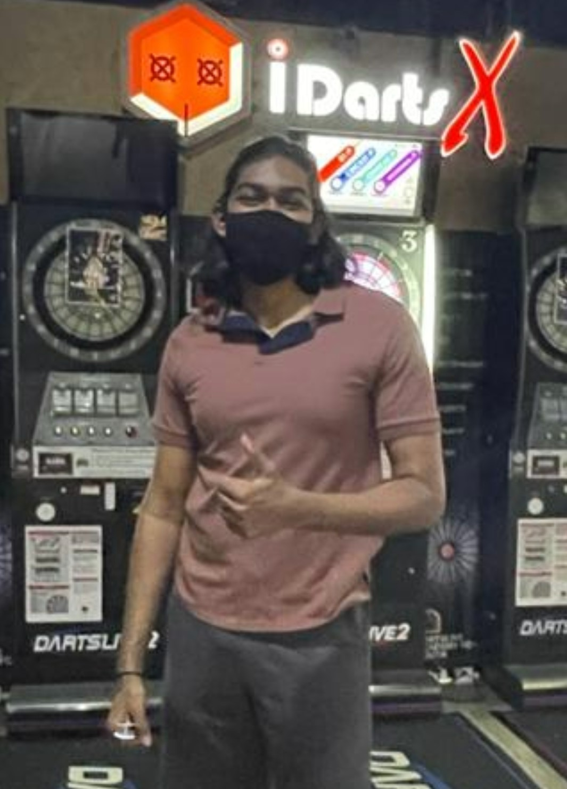

# About Me

## Who Am I?

{: width="30%"}
## More about me...
- ## Name : A Puvanan
- ## Course: Dip in Mechatronics & Robotics
- ## School: Mechanical and Aeronautical Engineering
- ## Year : 2
- ## Email : apuvanan.20@ichat.sp.edu.sg
- ## Tele : @puviee

## What intrigues me?
- ## Messing around with electronics
- ## Working out
- ## Playing darts
- ## Playing fifa

## Why did I take this DigFab elective?
I have a passion for DIY projects since I was young. Ever since I got to know there was a module that I could actually create cool projects and learn how to do them properly, I was eager to join.
I always had troubles documenting my past projects. With this module I can, not only apply this to my final project but also to my future DIY projects i embark on

## Key take-aways?
I hope I can learn the interesting hands-on skills and knowledge through EP1000 in the future. I wish to document my projects and share it to others whom also have a passion for such projects. Sharing knowledge makes learning even more fun :)
