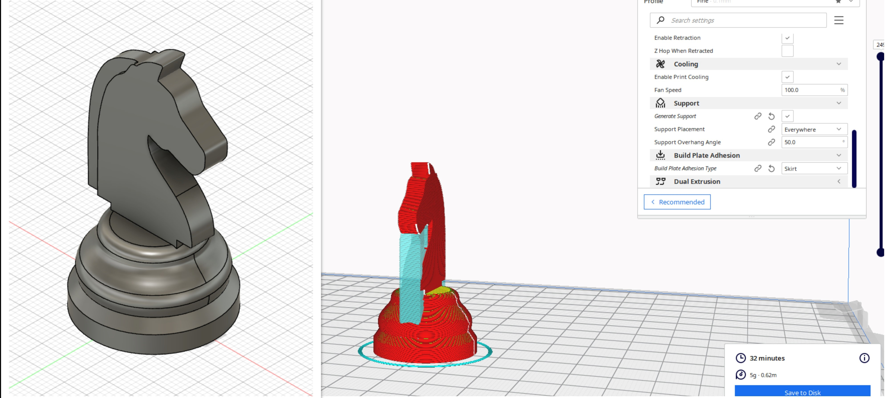
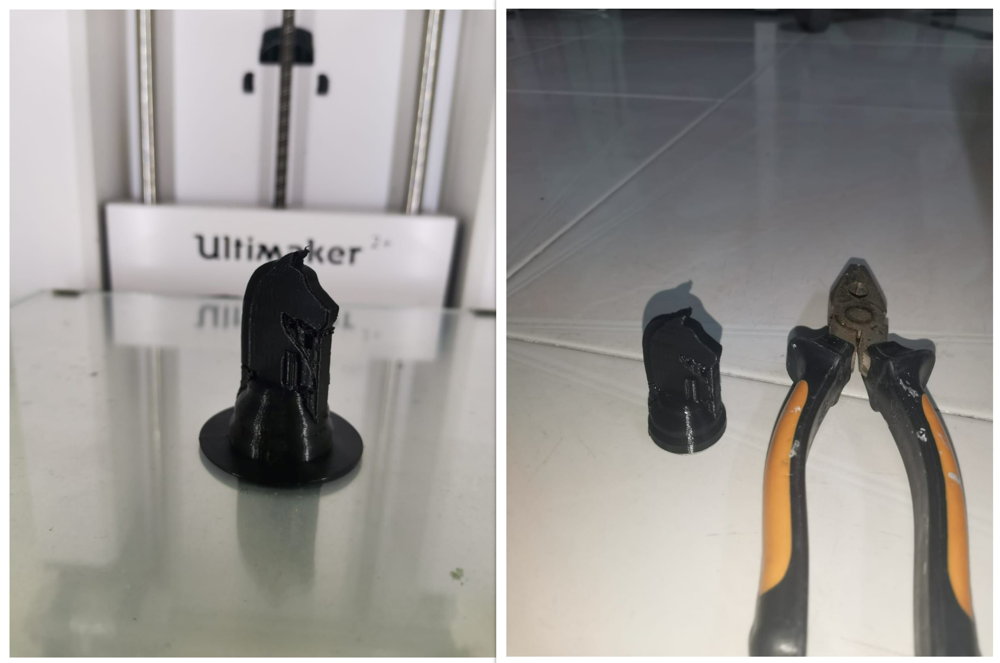
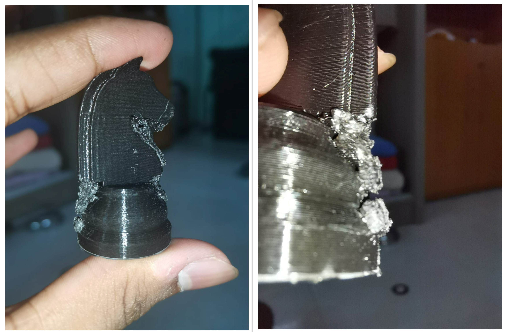
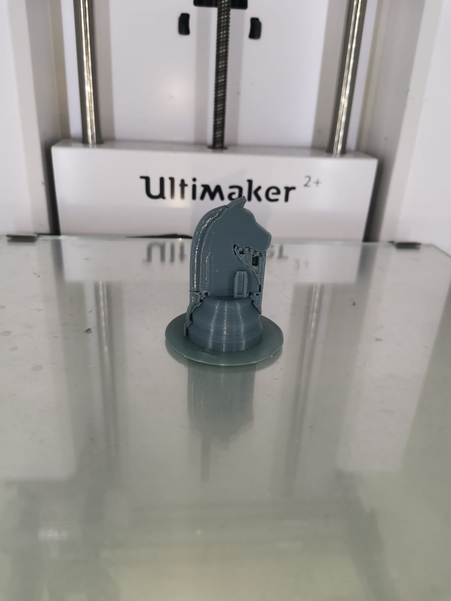
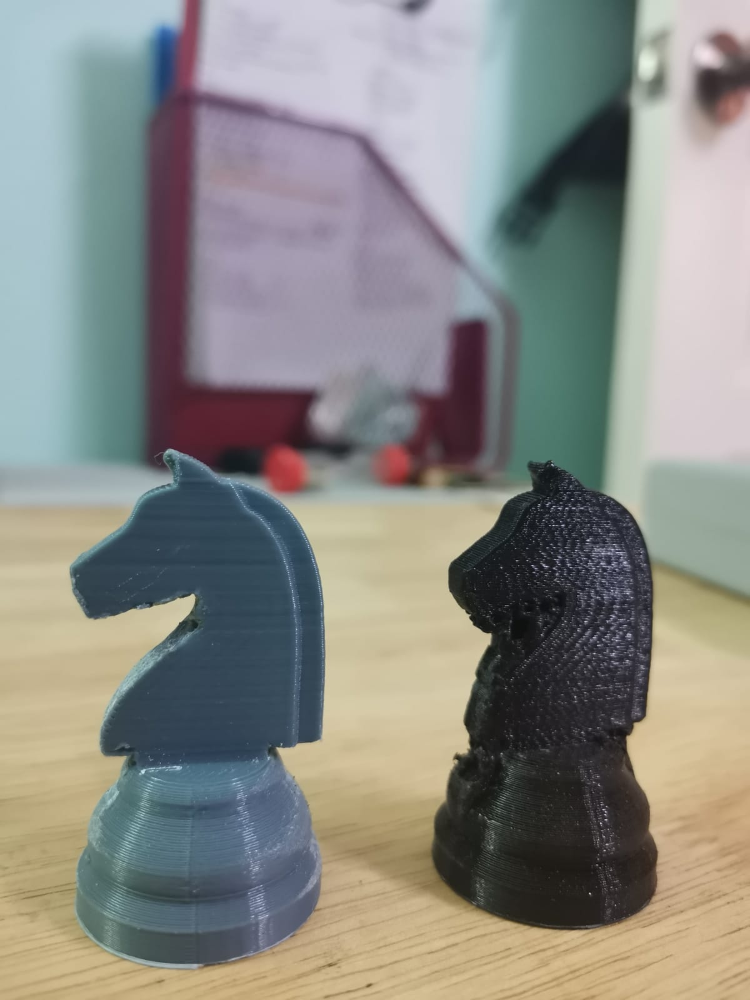
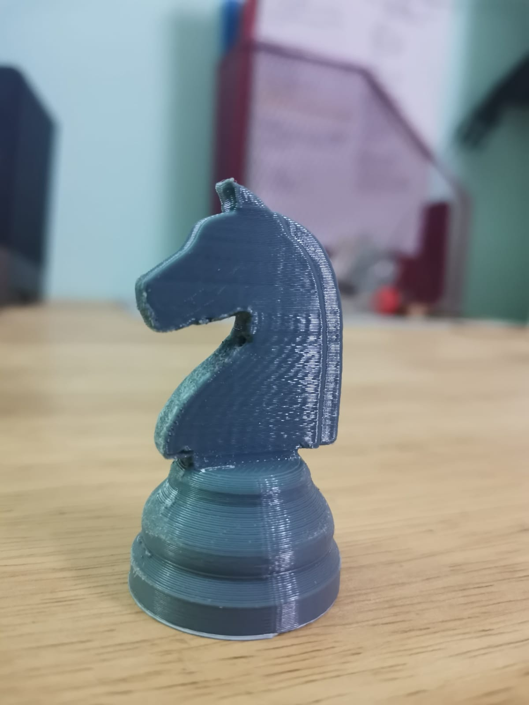

# 3D Printing
Here I will publish what I have learnt about 3D printing in EP1000!

3D printing opens up a whole new world of possibilities in design and fabrication. Using filaments such as PLA, we can achieve loads of unique prints. All you need is an idea!

## Knight Chess piece
We have already modelled and exported our knight piece as a.stl file. You can use any slicer in accordance to the 3d printer you are using. For my case, in the Fablab we are using Ultimaker 2+. So i downloaded [Ultimaker Cura](https://ultimaker.com/software/ultimaker-cura). Upload your file and slice it!

### Slicing and printing file
{: width="60%"}
1. Head onto file > open file > select your stl file
2. Click on the print settings > set the print values as per your wish
3. For my case, I kept my print speed at 60 mm/s. Base adhesion type as brim. Brim was chosen instead of skirt as our base is hollow and brim gives better support.
4. Layer height: 0.2mm. The nozzle size at fablab is 4, so your layer height should be half of it to give a good print. Wall thickness : 8mm
5. Top and bottom thickness was set at 8mm too. Infill density set to 20%. Infill density refers to how much plastic is inside your print and in our case, for visual purposes, 20% is good enough.
6. Lastly, enable support. Support everywhere. This is to prevent overhang. Overhang is when certain 3d geometries don;t have any support. Set the overhang angle to 50

### 3D printing process

- Here is a short clip of the 3d printing process. You can see how fast the ultimaker prints the knight piece!!

### After Printing
{: width="60%"}
1. Once your 3d print is ready, let it cool for a bit and you can pull it easily.
2. You will notice the support on different sides and it doesn't give the knight piece a good look. We will now remove it
3. Gather some tools such as sandpaper/file( this is to smoothen sides that are too small)
4. Pliers are very efficient in removing the support too!

### Removing support
1. Use the plier and dig in to remove the piece. Do not put too much force or the piece might break
2. Once you have removed the big pieces, certain small parts can be filed down and sand down using file/sandpaper.

### Problems encountered
{: width="60%"}
1. I didn't have a smaller plier like a long nose plier to remove the supports. Thus, the supports became mushed and harder to remove.
2. The edges were very hard to remove as they were underneath the knight head and body. Thus had to slowly sand down using sandpaper.
3. Other tools like minus key screwdriver or tweasers can also be used to remove the tiny parts.

### Redo
{: width="30%"}
1. Decided to redo the 3D print by learning from previous mistakes
2. Used the appropriate pliers to remove support from FabLab
3. Sandpaper to sand out the rough edges.
4. Lastly, added water onto sandpaper to get smoother surface and better finish.

### Difference( v1 vs v2 )
{: width="20%"}

### Final product
{: width="20%"}
**Lastly, you should have removed the supports and have a awesome Knight Chess Piece!!**
