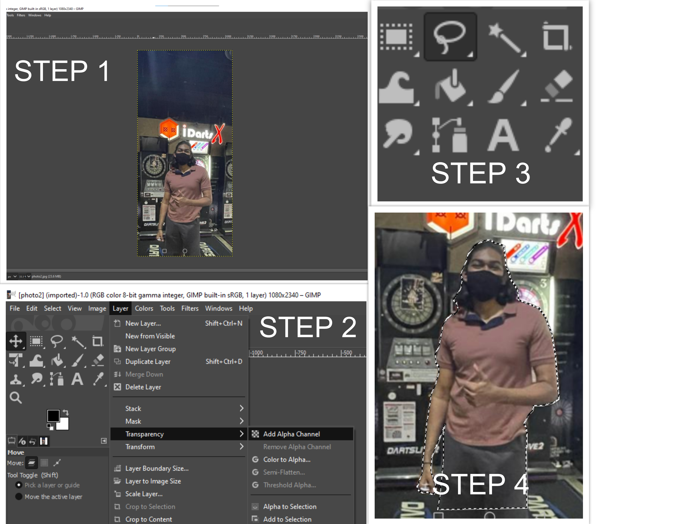
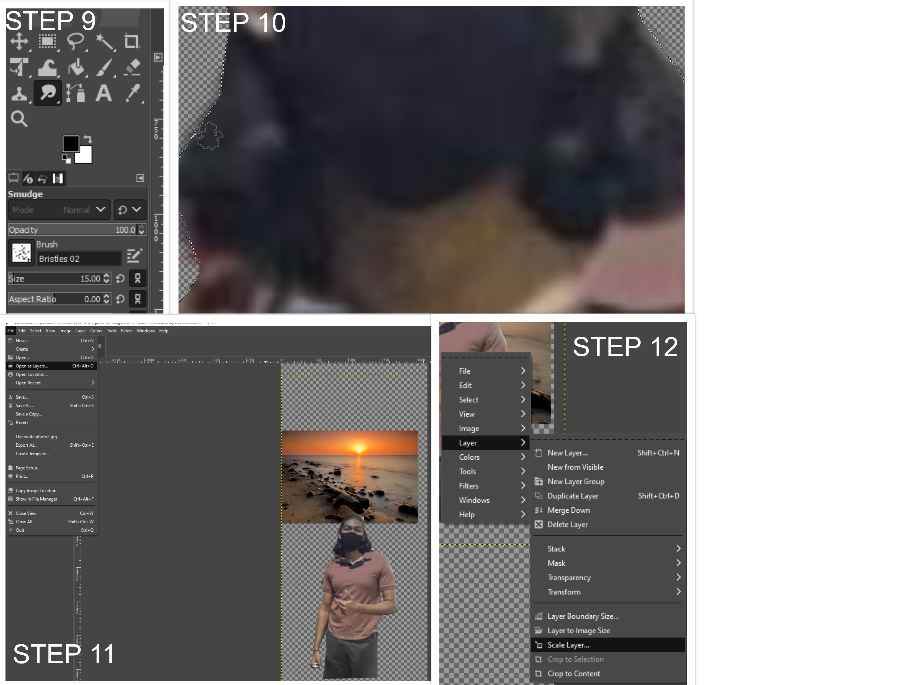
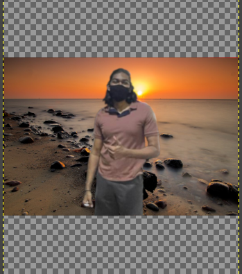
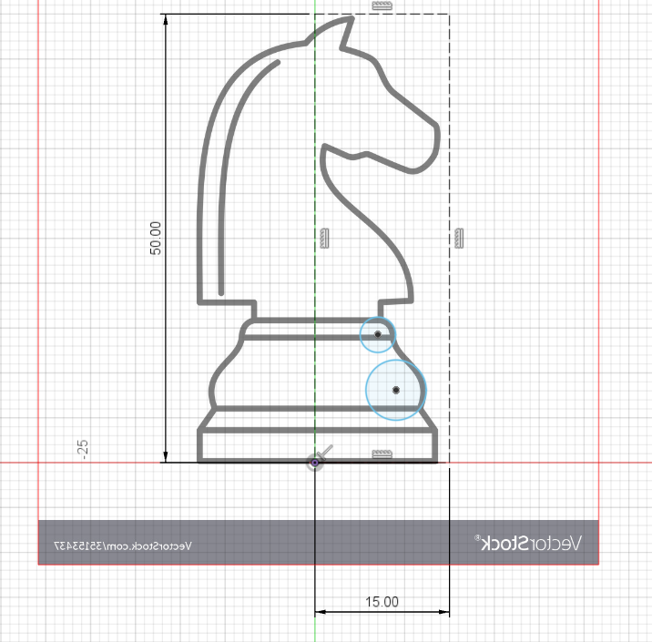
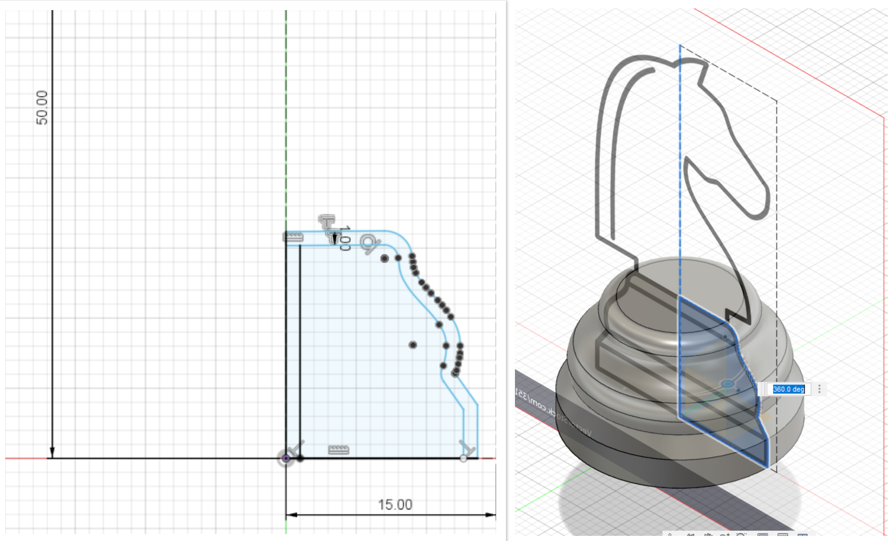
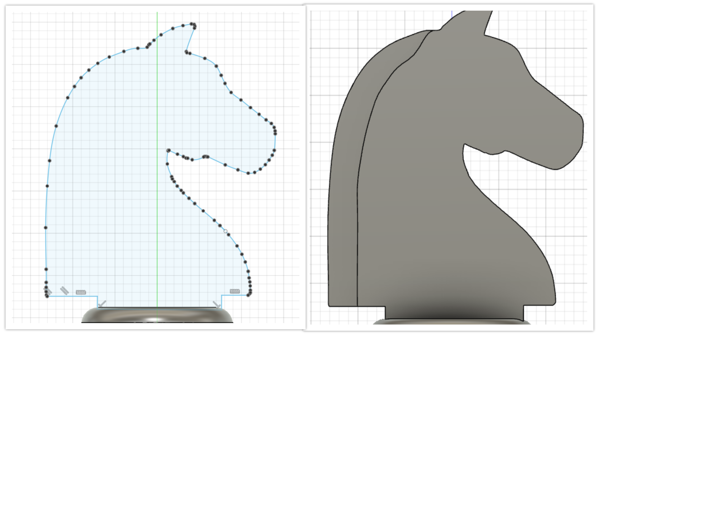
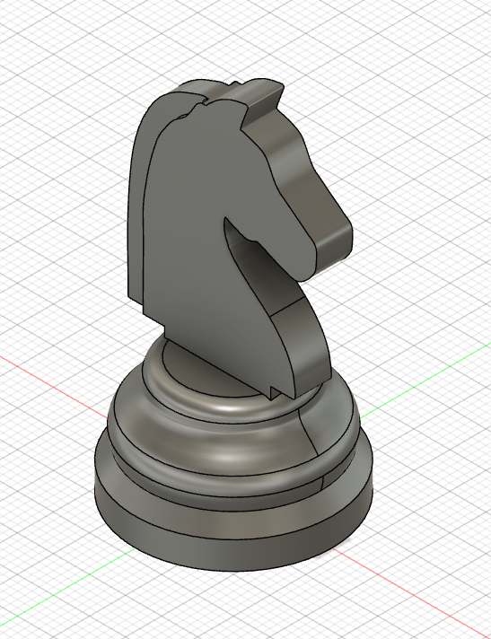

# Computer Aided Design

## Raster
One of the assignments for EP1000 is to learn and use raster graphics using a software called [GIMP](https://www.gimp.org/). We were tasked to remove the background of our selfie image and replace it with a seaside background of our choice. Most importantly, the image had to be resized to 1024 pixels wide.

### What is raster?
In short it deals with pixels on the screen. It is usually used for photographs, images. Some formats that raster exists in; .bmp,.jpg,.png

### How to edit background?
1. Launch GIMP and head onto File > Open > select selfie image.
2. Now we want to make add a transparent layer to later add our seaside image. So go to Layer > Transparency > Add alpha channel
3. In order to seperate your selfie from the background, click the third tool on the toolbox on the top left.
4. Start clicking and tracing out the image. When it comes to the final point, select on the original point and click ENTER.
{: width="60%"}

5. We have traced the outline of our image. However, we will still have the insides to trace out like the forearm. Below the tools section click the 3rd box. This allows you to select the insides.
6. Now using the same principle in step 4, trace all the inside images that you do not want to have, to create a better transparent image.
7. We now will head onto select > invert. This allows us to select the background of the image so we can delete it later.
8. Since we have selected the background, you should see the tracing appear on the outlines. Go on to edit > clear. This removes the background. Now you should see the mesh transparent background.
{: width="60%"}

9. We want to make our hair look more natural. So select the smudge tool on toolbox. After selecting you should see OPACITY tab underneath it. Set brush to BRISTLES 02 and size to 15. ( Bigger image= Bigger brush)
10. Smudge tool should appear. Left-click on your mouse and hold it while smudging through hair to make it look smoother.
11. Let's now add our seaside image. Go to file > Open as layer > select image. Once selected, use the move tool on your top left to align both image and background. **Toggle between layers to move them respectively**
12. Once you have aligned them. Right click on both images and go layer > scale layer > set image width to 1024 pixels and desired height respectively. Note, you have to align them again as pixels have changed.
13. Now all that's left is to export to png. Go to file > export as > destination folder > set file name. Under file type, locate and select png and export. (**tip: Just change .jpeg to png**)
{: width="60%"}
### You should now have this legendary image
{: width="20%"}

## Knight Chess Piece 3D Modelling
Another assignment was to create a 3D model of the knight chess piece. We all know it is a bit hard to create one from scratch. Soooo, let's cheat( **By using a canvas to sketch it out**).

### Adding Canvas and positioning it
1. Chess piece with base of 30mm and height of 50mm
2. Create a construction line box with 50mm height and 15mm base ( 15mm is used to centre the image )
3. Find a online vector image of knight piece
{: width="28%"}
4. Go to insert > canvas > include your image.
5. Position your image and resize it to the midpoint

### Revolve
{: width="40%"}
6. Create new sketch, choose y plane and sketch out the base to revolve.
7. Head onto to revolve function > select axis > revolve 360.

### Extrude and shell
{: width="35%"}
8. Create new sketch > spline line > sketch out knight head > extrude 5mm
9. Select shell function > shell base
10. **Now we are all ready to export this as .stl file and slice it for 3d printing.**

{: width="15%"}
