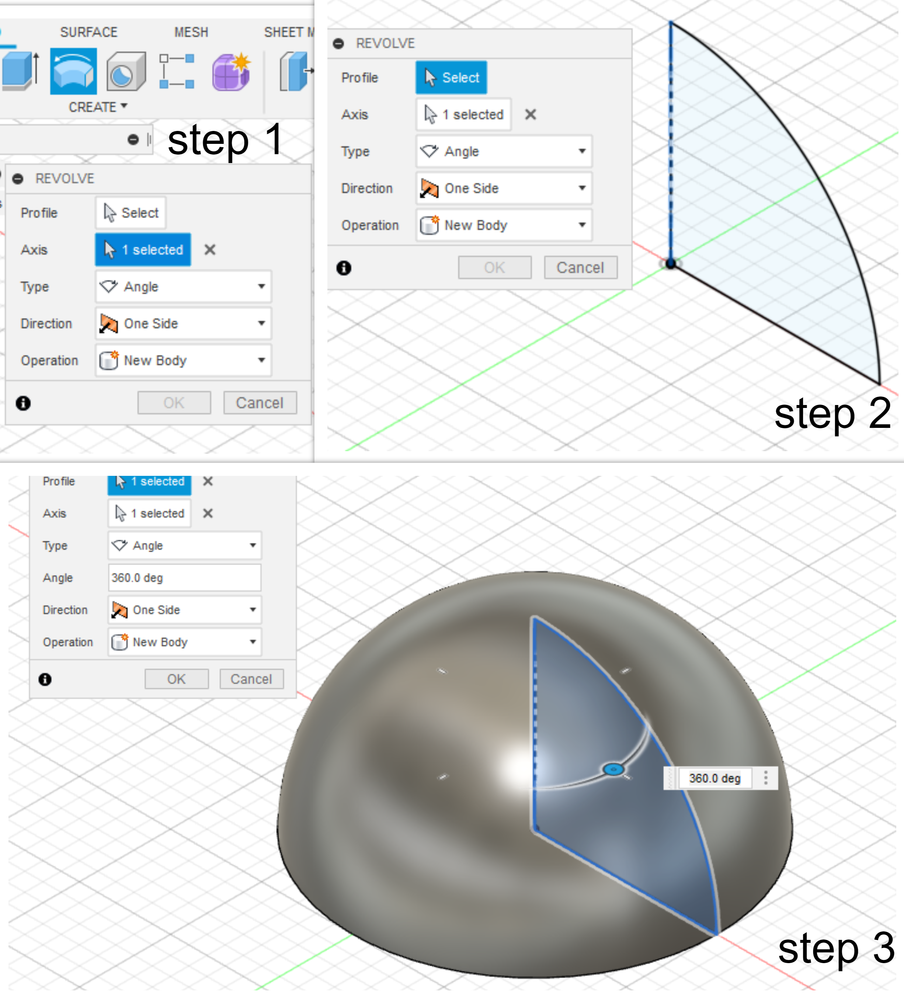
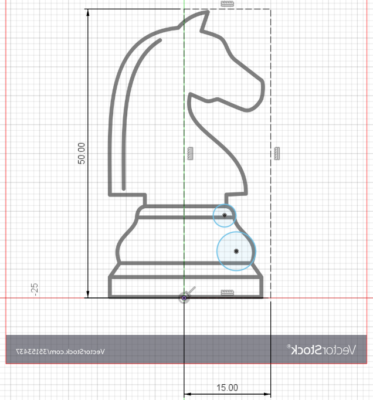
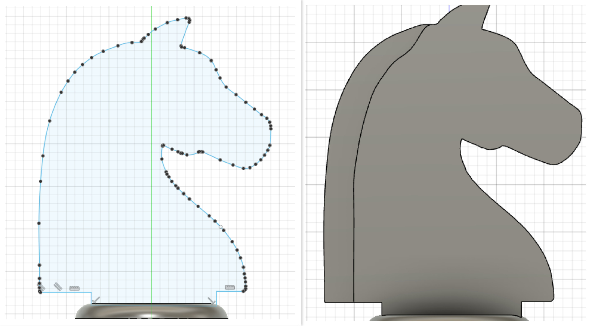

# Computer Aided Design

## Introduction
We will be going through varoius comouter aided designing on this page. They include the usage of GIMP for raster images, Inkscape for vector and Fusion360 for 3D modelling.

## Raster vs Vector
{: width="40%"}
* Vector graphics are digital art that is rendered by a computer using a mathematical formula. Raster images are made up of tiny pixels, making them resolution dependent and best used for creating photos

## Raster
One of the assignments for EP1000 is to learn and use raster graphics using a software called [GIMP](https://www.gimp.org/). We were tasked to remove the background of our selfie image and replace it with a seaside background of our choice. Most importantly, the image had to be resized to 1024 pixels wide.

### What is raster?
In short it deals with pixels on the screen. It is usually used for photographs, images. Some formats that raster exists in; .bmp,.jpg,.png

### Tracing out the image
{: width="60%"}
1. Launch GIMP and head onto File > Open > select selfie image.
2. Now we want to make add a transparent layer to later add our seaside image. So go to Layer > Transparency > Add alpha channel
3. In order to seperate your selfie from the background, click the third tool on the toolbox on the top left.
4. Start clicking and tracing out the image. When it comes to the final point, select on the original point and click ENTER.

### Clearing the background
{: width="60%"}
5. We have traced the outline of our image. However, we will still have the insides to trace out like the forearm. Below the tools section click the 3rd box. This allows you to select the insides.
6. Now using the same principle in step 4, trace all the inside images that you do not want to have, to create a better transparent image.
7. We now will head onto select > invert. This allows us to select the background of the image so we can delete it later.
8. Since we have selected the background, you should see the tracing appear on the outlines. Go on to edit > clear. This removes the background. Now you should see the mesh transparent background.

### Fianl touch-ups and scaling image
{: width="60%"}
9. We want to make our hair look more natural. So select the smudge tool on toolbox. After selecting you should see OPACITY tab underneath it. Set brush to BRISTLES 02 and size to 15. ( Bigger image= Bigger brush)
10. Smudge tool should appear. Left-click on your mouse and hold it while smudging through hair to make it look smoother.
11. Let's now add our seaside image. Go to file > Open as layer > select image. Once selected, use the move tool on your top left to align both image and background. **Toggle between layers to move them respectively**
12. Once you have aligned them. Right click on both images and go layer > scale layer > set image width to 1024 pixels and desired height respectively. Note, you have to align them again as pixels have changed.
13. Now all that's left is to export to png. Go to file > export as > destination folder > set file name. Under file type, locate and select png and export. (**tip: Just change .jpeg to png**)

### You should now have this legendary image
{: width="20%"}

## Vector

### What is a vector image?
* Vector graphics, as a form of computer graphics, is the set of mechanisms for creating visual images directly from geometric shapes defined on a Cartesian plane, such as points, lines, curves, and polygons.
* We will be making a logo of an animal which will then be used as a design for future laser cutting projects!

### What will you need?
* Software such as [inkscape](https://inkscape.org/release/inkscape-1.1.1/)
* Patience :)

### How do I turn my image to a vector image?

{: width="45%"}
1. Let's first open inkscape > head onto new document > open > select your [animal picture](https://res.cloudinary.com/dk-find-out/image/upload/q_70,c_pad,w_1200,h_630,f_auto/A-SPL-C0066487-Southern_Flying_Squirrel_zur24q_flgzzp.jpg)
2. On your left bar, select the bazier line function ( underneath spiral looking option ) > click on bazier spline. We will use this to draw on our animal.
3. Start drawing on your animal. However, only draw the body. Leave the limbs and head and tails for later.
4. Spline all the way from start to around the animal and back to the first point. Then double click to end spline!
5. Change colour by selecting a colour of your preference.
5. There will be a black outline. To colour it , hold shift+ click on the colour to change it :)

{: width="45%"}
1. Use the spline function again to draw your limbs. Avoid other portions of the body and colour the same.
2. Give a colour code for the limbs now to differentiate them later.

{: width="45%"}
1. Select your background squirrel image and right click > then hide image.
2. Spline the face and then the ears and the chin and finally the nose. Don't forget to colour code them!
3. Repeat the spline function for different aspects of the animal. For me I had to section and colour the face, the nose and the chin.
4. Lastly, spline the tail and colour code it.
5. You should havea finished animal vector image. You can shift select different parts of the animal to change to colours of your choice.

### Final vector image
{: width="38%"}

## 3D modelling with Fusion360
* 3D modeling is the process of developing a mathematical coordinate-based representation of any surface of an object in three dimensions via specialized software.
* In this module, we will use Fusion360 to 3D model objects for our project and assignments.

### Fusion360 Practice
{: width="30%"}
* We will be learning how to make this 2D model in this practice.

{: width="30%"}
1. First create the circular features using the origin to constraint it. Use the circle function to create a circle Radius 20mm circle
2. Go to create> arc> centre point arc> Create a arc from the origin of the previous circle at radius 35mm.

{: width="30%"}
1. Now lets finish the exterior rectangle feature. You can either use a rectangle and trim out the interior or use the line function like me.
2. Head to the line function> from one end of the arc, draw a 60mm line down.
3. From the previous point, draw a 70mm line perpendicular to it( horizontal)
4. Repeat the same thing and connect it to the other end of the arc.

{: width="30%"}
1. We want a 50mmx15mm rectangle inside. This should be 10mm and 15mm away from the sides respectively. We shall use a different rectangle function!
2. Go to create> point> and create a point on the midpoint of the 70mm base line.
3. Press D on your keyboard and click on the point and the base line. Dimension it to 22.5mm (15mm away from bottom + 7.5-midpoint of rectangle)
4. Go to create> rectangle> centre rectangle> set length to 5mm and height to 15mm!
5. Now we have finally finished the practice!

### Extrude Practice
* In a sense, extrusion is basically giving an 2D object volume. We can say it gets thicker.

{: width="50%"}
1. We will extrude the practice 2D drawing from earlier on. Finish sketch and you should have 2D model.
2. Click on the extrude function at the top left.
3. A mini pop-up should appear.For profile, click on the 2D model excluding the circle inside. We want to make the object with a hole.

{: width="55%"}
1. For direction, it is automatically set one side. We want to give 10mm thickness, so set 10mm. You should see the arrow point to the right and object will have 10mm thickness.
2. Let's play around with this direction. Change 10mm to -10mm. This makes it extrude the other way around. Arrow will point to left now.
3. Change one side to 2 sides now. Now, from the 2D model, you can extrude a certain distance to the right and another distance to the left. I've set 10mm for both. Give it a go!
4. Change 2 side to symmetric. Essentially, this extrudes the 2D model symmetrically on both sides with a set value. If I put 10mm, it should extrude 10mm in both right and left.

### Revolve practice
* Revolve is basically making circular objects and features using a centre line.

{: width="60%"}
1. Go to new sketch> select the y plane. Go to line function and draw line vertically from the origin.
2. At the right of your screen you should see a grey tab. Click on your line> head onto the tab> change it to construction line. This acts as an axis to revolve later on.
3. Go to create> arc> centre point arc> create a 50mm arc. Draw a line from both of ends to the origin. ( It is fine to overlap the construction line)

{: width="40%"}
1. Click finish sketch> click the revolve function on the top left. A pop-up should appear.
2. Fusion360 recognises the construction line and selects that as axis. In future models, you can change to another axis by clicking on axis on the pop-up> select your new axis.
3. For profile, click on your 2D model. You should see it made a circular feature from the quadrant we created.
4. **Hope you got a good sense on what revolve is**

## Knight Chess Piece 3D Modelling
Another assignment was to create a 3D model of the knight chess piece. We all know it is a bit hard to create one from scratch. Soooo, let's cheat( **By using a canvas to sketch it out**).

### Adding Canvas and positioning it
{: width="31%"}
1. Chess piece with base of 30mm and height of 50mm
2. Create a construction line box with 50mm height and 15mm base ( 15mm is used to centre the image )
3. Find a online [vector image](https://www.google.com/imgres?imgurl=https%3A%2F%2Fcdn3.vectorstock.com%2Fi%2F1000x1000%2F34%2F37%2Fwhite-chess-knight-piece-on-background-vector-35153437.jpg&imgrefurl=https%3A%2F%2Fwww.vectorstock.com%2Froyalty-free-vector%2Fwhite-chess-knight-piece-on-background-vector-35153437&tbnid=veq07LuDYJTTEM&vet=12ahUKEwiSlI2v97D0AhWFNCsKHQS0AfcQMygKegUIARDwAQ..i&docid=jiylB55YKg2efM&w=1000&h=1080&q=knight%20chess%20piece%20vector&ved=2ahUKEwiSlI2v97D0AhWFNCsKHQS0AfcQMygKegUIARDwAQ) of knight piece
4. Go to insert > canvas > include your image.
5. Position your image and resize it to the midpoint

### Revolve
{: width="40%"}
6. Create new sketch, choose y plane and sketch out the base to revolve.
7. Head onto to revolve function > select axis > revolve 360.

### Extrude and shell
{: width="35%"}
8. Create new sketch > spline line > sketch out knight head.
9. Trace out the sketch and once done, finish sketch.
10. Select extrude function > enter 5mm > extrude both ways( Our plane was in the centre so it extrudes both ways from centre to reach 5mm).ss
9. Select shell function > click base > thickness = 1-2mm > click ok.
10. **Now we are all ready to export this as .stl file and slice it for [3D Printing](https://puvie2005.github.io/PuvananBlogsite/docs/3dprint.html).**

{: width="15%"}
