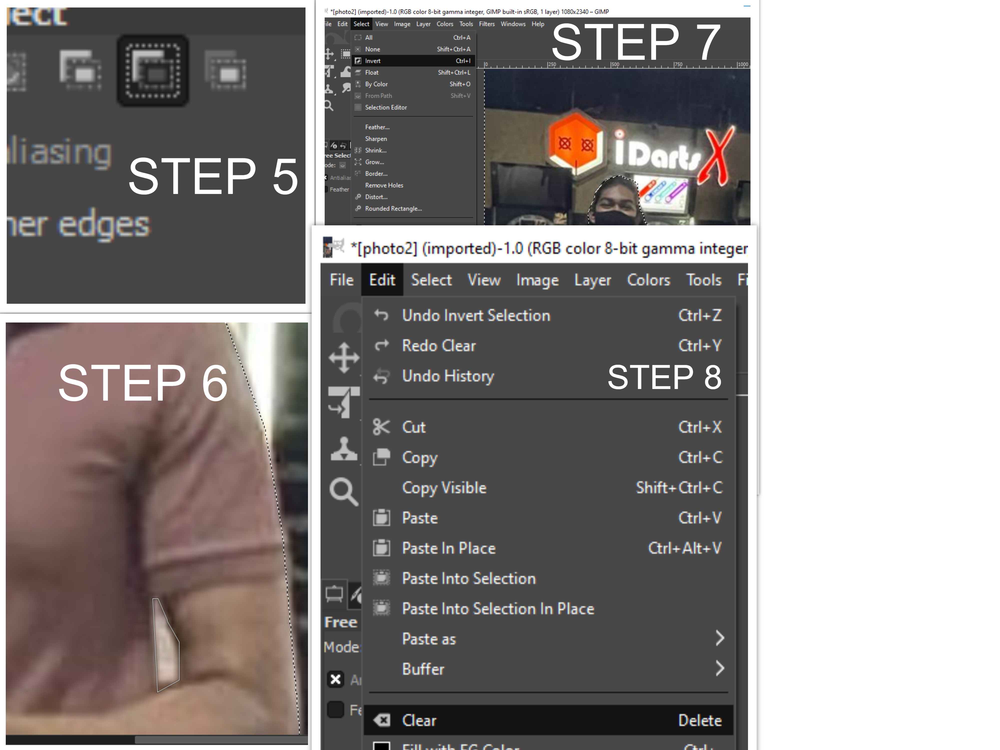

# Computer Aided Design
Notes on CAD

## Assignment

### Raster
One of the assignments for EP1000 is to learn and use raster graphics using a software called [GIMP](https://www.gimp.org/). We were tasked to remove the background of our selfie image and replace it with a seaside background of our choice. Most importantly, the image had to be resized to 1024 pixels wide.

#### What is raster?
In short it deals with pixels on the screen. It is usually used for photographs, images. Some formats that raster exists in; .bmp,.jpg,.png

### How to edit background?
1. Launch GIMP and head onto File > Open > select selfie image.
2. Now we want to make add a transparent layer to later add our seaside image. So go to Layer > Transparency > Add alpha channel
3. In order to seperate your selfie from the background, click the third tool on the toolbox on the top left.
4. Start clicking and tracing out the image. When it comes to the final point, select on the original point and click ENTER.
{: width="60%"}

5. We have traced the outline of our image. However, we will still have the insides to trace out like the forearm. Below the tools section click the 3rd box. This allows you to select the insides.
6. Now using the same principle in step 4, trace all the inside images thaat you do not want to have to create a better transparent image.
7. We now will head onto select > invert. This allows us to select the background of the image so we can delete it later.
8. Since we have selected the background, you should see the tracing appear on the outlines. Go on to edit > clear. This removes the background.
{: width="60%"}
