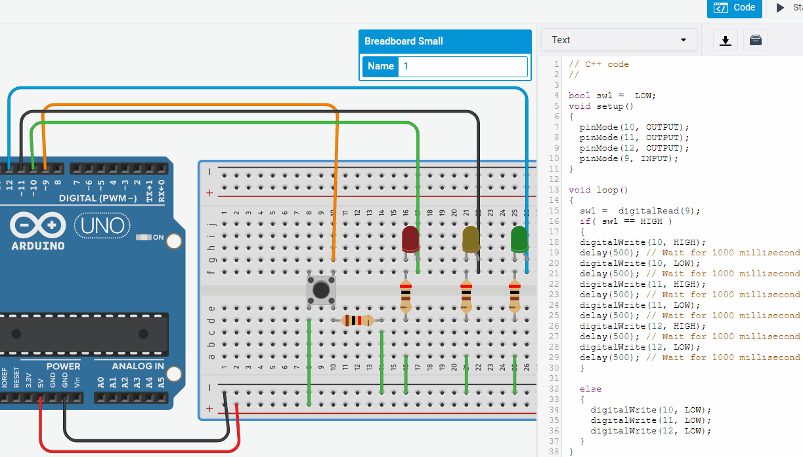

# Embedded Programming
Embedded programming is basically programming embedded systems. Embedded systems refers to a computer system. A combination of a computer processor, computer memory, and input/output peripheral devices—that has a dedicated function within a larger mechanical or electronic system.

## Introduction to Arduino
For this module, we will be using Arduino Uno/Nano for our embedded programming sessions. Using a microcontroller and coding it to achieve our desired output is the gist of this page. I will be talking about the basics of the microcontroller and the code in this page.

## Arduino

* Arduino is a microcontroller. A microcontroller is basically a small computer that takes in a programming code to achieve input/output.
* I will talk about the common Arduino microcontroller which is the Arduino Uno.
* There are more than 1 coding languages used to program this Uno. For example, C++ and Python.

### Hardware
* The Arduino UNO operates at 5V. This is called as the operating voltage. This is important as the UNO can only poweer devices within this voltage threshold.
* It can be powered by batteries(eg. 9V ) or via the USB. The usb can be connect via a computer that is used to program the UNO or a seperate USB power source.
* There is a reset button on the UNO. This is used to restart the program from it's first line of sketch.
* There are pins 5v and 3.3V. This is the supply voltage Pins
* The GRND pins are known as ground. In electronics, ground is known as the referance( starting) point for voltage. Supply and GRND pins are important to power up the components on a breadboard.

### Analog Input
There are certain pins on the Arduino UNO that helps to recieve analog signals from electronic components. These components can be sensors such as Temperature and Humidity sensor. These analog signals from these components are transmitted to the Arduino Uno via pins laballed as A0 to A5( 6 Pins ). The Arduino Uno then converts these analog signals to digital signals to achieve a certain ouput. Analog pins are important as they help the microcontroller communicate with alot more components.

### Digital I/O
Digital pins serve a similiar purpose as the Analog input pins. However, the UNO does not need to convert these digital signals to anything. These I/O pins are used to transmit or recieve digital signals from/to various components. Components such as LEDs and micro-servos. This is achieved by the pins, 2 to 13,  on the Arduino UNO.

### Input/Output devices

* Input and output devices are electrical components that are used to achieve a desired outcome via the embedded system. In this section we'll run through varipus I/O devices that range from analog to digital.
* Red arrows going into the arduino are the input devices. These feed various signals( information) to the arduino.
* The blue arrows are the output devices.

#### Input devices
* Pushbutton. Input device that uses digital signals. Uses logic "1" or "0" to produce outcome via toggling between states.
* Toggle switch( SPDT ). Single pole double throw toggle switch. Input device like the pushbutton that uses digital signals but with more states to switch between.
* Temperature sensors. Analog signal produced by measuring temperature.

#### Output devices.
* LEDs. Light emitting diode that uses digital signals to produce light.
* DC Motor, Stepper motor and etc. Uses both analog and digital signals to output continous rotary motion or at positions.
* Piezo buzzer. Outputs sounds via digital signals.

### Programming the arduino ( basics )
* We will be using Arduino IDE to program our UNO. We can also use tinkercad to wire-up the arduino and put our code in for simulation purposes.
* Head onto the [Arduino Website](https://www.arduino.cc/en/software) to download the IDE for free and we can continue learning the basics.
* You can also use [tinkercad](https://www.tinkercad.com/dashboard) which is a website to test out circuits and code.

### Arduino IDE

* After downloading the IDE, this should show up. This is where you will br writing your code and uploading onto the Arduino UNO.
* Before we go through the basics, let's setup the IDE.
* Go to tools > boards > select the board you are using. In our case it is the Arduino UNO.
* If you do not select the correct board, the IDE will have troubles uploading the code to it as the system can't recognise the board plugged into the computer.

* At the top of your screen, there are few buttons to toggle between.
* The "tick"/ check box is used to verify the code. This will complie your code and check for any errors prior to uploading.
* The arrow button is to upload the code into the board. Don't worry if you didn't verify, the IDE will verify and let you know anyways :)
* The other 3 buttons are "new", "open" and "safe" from left to right.

* You will need void setup() and void loop() to run your code. Without these, the code will not work.
* The code that you put inside void setup() will only run once, and that will be at the beginning of your program.
* One example is when you want to turn your robot on — that does not happen multiple times!
* In void loop(), your code will repeat over and over again.
* Examples are when your robot is driving or using its sensor to check for obstacles.

### tinkercad
I will be demonstrating various circuits and codes via tinkercad. You can try it yourself and mess around with the tinkercad!

### Basic Components

* We will be using few compoents from the list you see above.
* Breadboard- A thin plastic board used to hold electronic components
* LEDS and resistors
* Pushbuttons
* Arduino UNO
### Blinking LED

* Create a new design on your tinkercad dashboard
* On the right side of the screen you will find a search panel. This is where we will find our components to make our circuits
* Search and place the following components to make our blinking LED circuit
* Arduino UNO, LED, Breadboard and resistor(any value not too high impedance)

### Wiring

* Connect the 5v and ground to the positive and negative terminals on the breadboard respectively
* Place the led onto the working area of the breadboard.
* connect 1 terminal of the led to positive of breadboard.
* place the resistor perpendicular to the led and connect the other end to the ground. Now you should have a electrically working circuit.

### Coding
{: width="80%"}
* In void setup we want to establish which pin the led is connected to recieve any commands. Use the "pinMode(XX, OUTPUT)" command
* "XX" is the pin number the led is connected to. You have to type in OUTPUT to establish output a command.
* Do not forget your ";" at the end of every one of your line in the sketch
* In void loop we will use the "digitalWrite(XX, HIGH/LOW)" and the "delay()- in milliseconds" commands.
* Start off the digitalWrite and mention the pin "10" and assign it as "HIGH" to turn it on.
* Place a delay(500). This keeps the led ON for half a second.
* Next up use the digitalWrite function but set it as "LOW". This turns off the LED
* Place a delay(500). This turns off the LED for half a second. Since this is in void loop, this cycle will repeat causing a blinking repetition :)
* Take note that the IDE is case-sensitive. Use CAPS for "HIGH", "LOW", "OUTPUT" and "INPUT". Note the capital "W" in digitalWrite.

### Traffic light
{: width="40%"}
* Let us retry the previous example but with a different variation.
* We will be adding another 2 LEDs to control a blinking process.
* Give it a go with the experience from the previous Example

### 3 LED Coding

* Essentially we are using the same logic as the previous one.
* I have used pins 10, 8 and 9 for 3 different coloured LEDs to simulate a simple traffic light system.
* Instead of 2 digitalWrite to turn off and on the 1 led, we will be needing 6 of it to control 3 LEDS.
* Just add in another 4 more digitalWrite with logic "HIGH" and "LOW" along with any delay timings you like!
* Take a look at mine :)

### Adding pushbutton?

* Let's make it interesting. We shall add in a pushbutton switch. Now, whenever we can the LED to blink we can just press the buttons
* If we do not press the button, the LED will not blink as it will stay "LOW".
* For a pushbutton there are 2 states, true or false. We will use bool function ( boolean) as it switches between these 2 states
* In order to establish a variable, it has to be done before the void setup. Thus create a variable called "sw1" and assign it to bool as "LOW" as the initial state.
* Make sure you establish which pin the button is connected in the void setup using "pinMode".
* Since we are not writing anything into the button, we want to read data ( true or false), so we use "digitalRead" in the void loop
* We will be using a if-else statement to toggle commands between the "True" or "False" states.
* In the if loop, we establish it as the command if the sw1 is "HIGH". Inside this loop enclose your blink code with "{}".
* In the else loop, we establish it as the command for the sw1 is "LOW". We do not need to mention "LOW" as automatically known as the next possible outcome.
* Inside the else loop, chuck in your turn off led with no delay. This makes sure your LED is off all the way as long as your button is not pressed.

### Pushbutton traffic light

* Use the previous example, but now add in a green and yellow LED
* We have done this example previously with traffic light LEDs, however, now just use the last example to add a switch.
* If the switch is pressed, a traffic light sequence will complete.
* If the switch is released, the sequence will finish and all the leds will stop lighting up.

## Assignment 12

* I have shown you the basics of LED and the pushbutton. Now we will try different sequences using both components.
* This assignment is a continuation of the knowledge we have learnt from previous examples. Follow the sequence Below
* All off > Red LED on > Green LED on > Yellow LED on > Red, Yellow and Green turns on consecutively and all shuts down.
* We will be using count logic to count up to different cases

### Code
{: width="40%"}
* Define the LED using any name for it
* Establish count, runway and state integers before void setup
* Use pinMode in void setup for LEDs and pushbutton. Use decode for the count.
* In our void loop we establish the states and the count system for differenr cases
* We create a void decode to setup the 4 different cases including a state where all are off. Tinker with the cases to make it output to whatever you want!

### Assignment 12 Real Life Demo

## 555 timer assignment
{: width="40%"}
* We were tasked to turn this schematic of a 555 ic circuit in tinkercad.
* Below is a simulation of the schematic on tinkercad

{: width="40%"}
* WHat you are seeing is basically on and off signals going off consecutively in repetitions.
* This causes the led to blink. That is why you can see the voltage alternating between 13v and 5v.
* This is the simulation of 555 assignment :)

## Emdedded programming with sensors

### Using Ultrasonic sensors
* Ultrasonic sensors measure distance form objects and we can use that to achieve certain outcomes.
* We can make a green led light up if an object comes near to it.
* If no object is near, the red led is lit up continously.

### Using motion sensors
