# Laser Cutting

## Laser cutting test
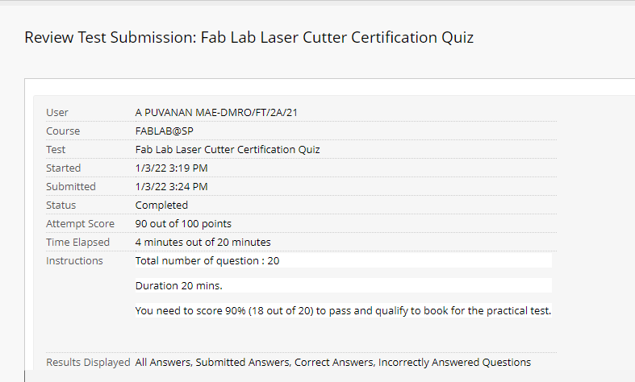{: width="40%"}
* A laser cutting test had to be done prior to the music box assessment.
* We were tasked to produce a 2d keychain design, modify via CorelDraw and print it using the laser cutter.

### How do I go about laser cutting?
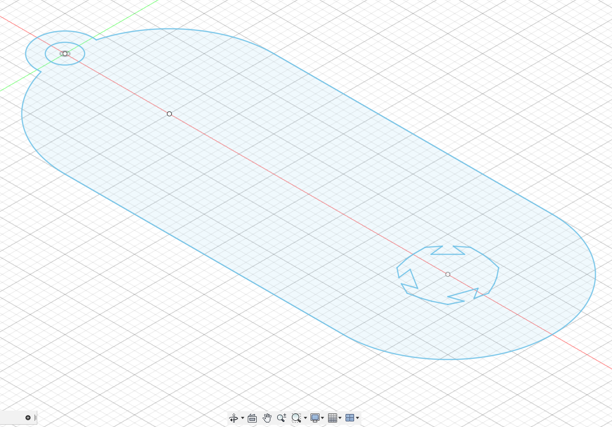{: width="40%"}
* This is my 2D drawing of a keychain with my logo
* You can access it through here for a sample drawing.

### Laser cutting with CorelDraw
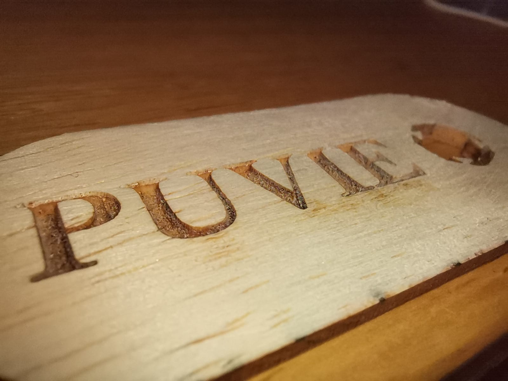{: width="40%"}
* Once you have imported your 2D drawing to CorelDraw, shift select the drawing and press ctrl+g.
* Change the colour of the 2D model to red. For our settings, we used red to cut with preset speed and power. Use in accordance to your laser cutter
* Move it to a point to cut on the wooden board.
* Add text of your choice and position it. Make sure it is black( for Fablab laser cutters)
* Click pointer and select the starting point of the image. Click go to pointer and now you can start laser cutting.

## Music box
To put our lasercutting and CAD skills to the test, we were tasked to design a simple music box and lasercut it. This section will be split into parts. Firstly the **CAD** portion and there on we will look into the **Lasercut** portion.

## CAD Design
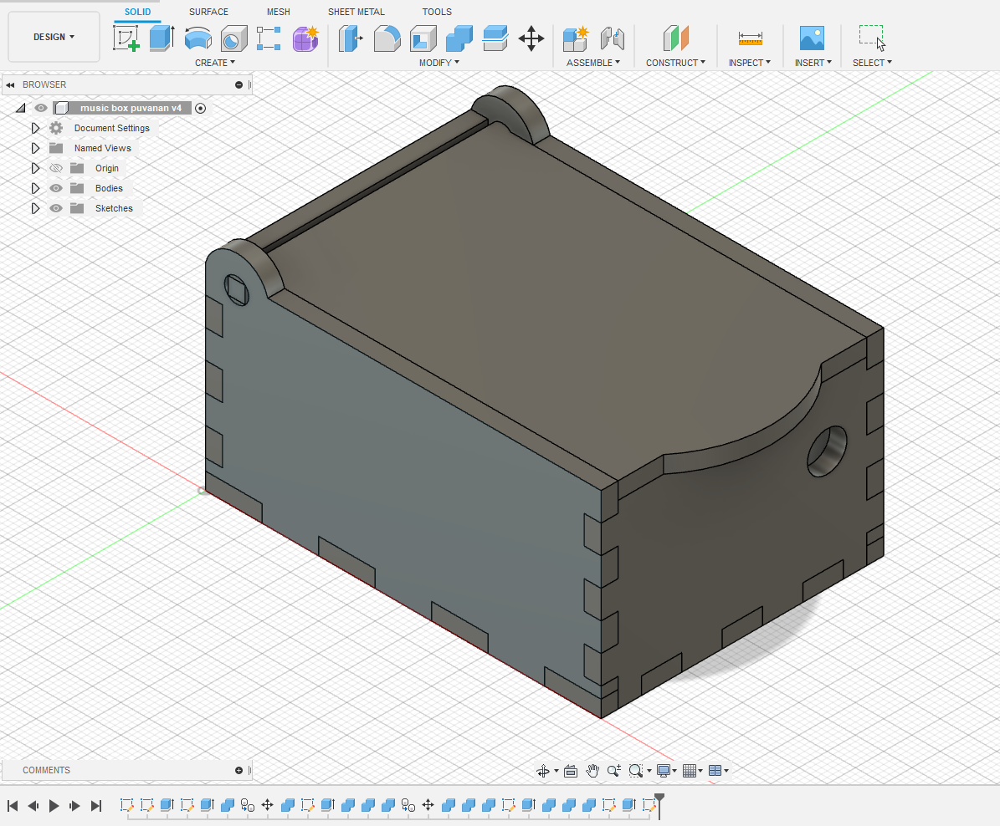{: width="40%"}
* We will learn how to design a simple music box using Fusion360.

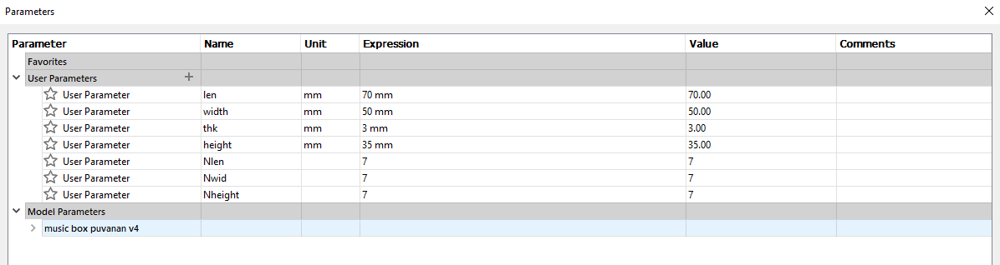{: width="60%"}
* We will be using Parametric modelling. Parametric modelling refers to creating a 3D model with speicified dimensions that can be controlled. We call this controlled dimensions( constraints )
* These dimesnsions such as height, width and length will be controlled.
* You will notice thickness as "thk". This refers to the overall thickness of the box. Instead of extrude we use thck.
* 1 feature you will see is Nlen, Nthk and etc. This is used for creating multiple teeth on the sides of each wall to interconnect and join when finished.

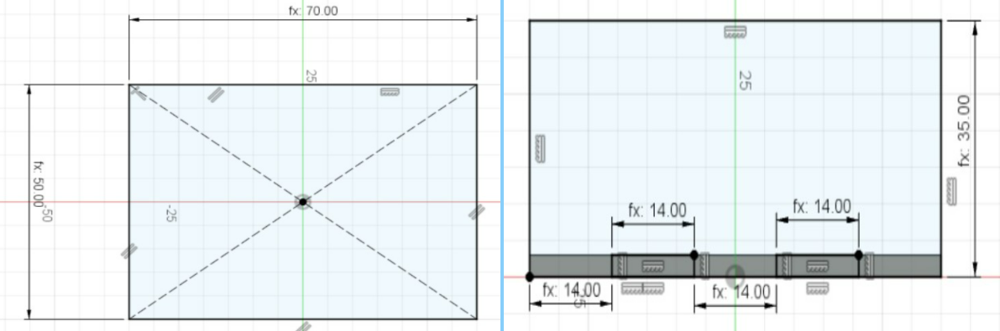{: width="60%"}
* We start off by creating 50mm by 70mm base with fixed parameters.
* Next create the side wall with dimensions of 35mm height.
* We want to create teeths on the wall such that it can connect to the base. We will use the Nlen functions
* For each teeth dimensions we will use the equation " len/Nlen". This gives us equidistant teeths in a given controlled parameter.

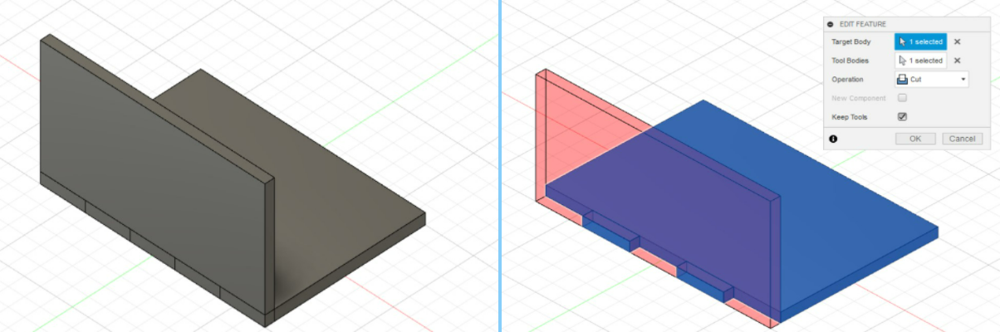{: width="60%"}
* Now we will use the combine function to insert the teeths from the wall to the base.
* Firstly extrude both wall and base with thk. Use thk as a generic thk measurement throughout the process.
* Head onto combine > Copy and move the front wall to the opposite side of the box using the Copy/Move (Point to Point) function to make the back wall
* Remember to use the combine function again to get the teeth for your back wall.

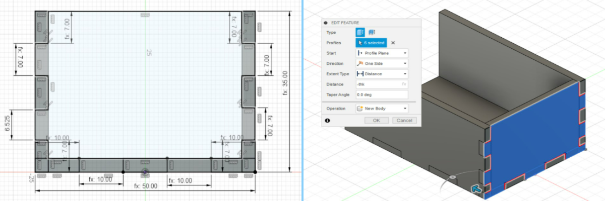{: width="60%"}
* For the other side wall, we will make this sketch.
* For the bottom teeth we will use width/Nwidth
* For the side teeths we will use height/Nheight.

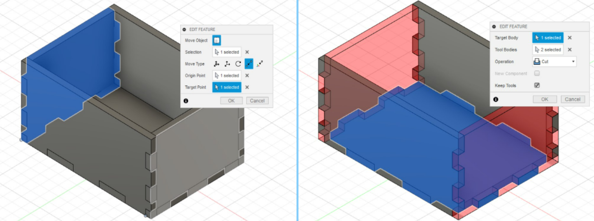{: width="60%"}
* Similiar to previous step, we will extrude with thk and Copy/Move (Point to Point) for combine

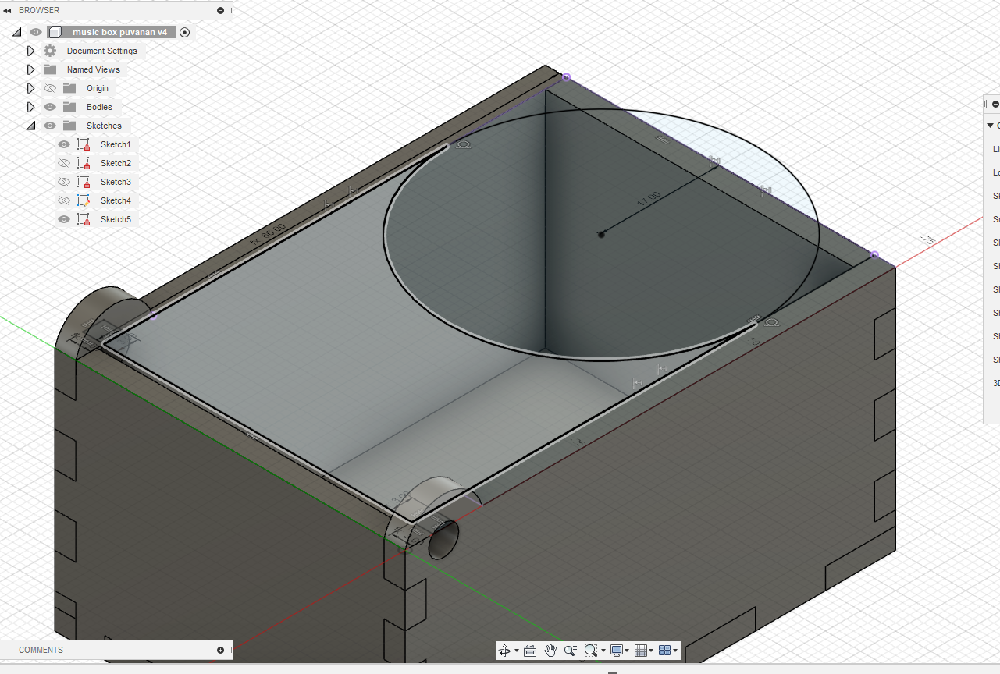{: width="40%"}
* We will make the lid first.
* You can make the lid in whichever way you like.
* Do not forget to add the 2 handles to pivot on both corners for the lid so it stays in Place

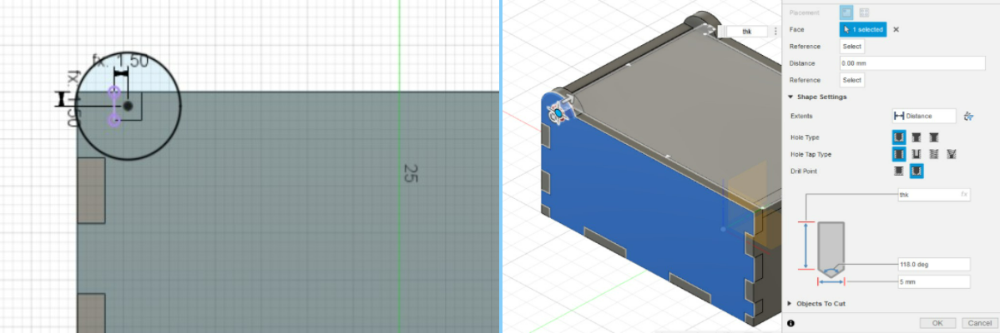{: width="60%"}
* Now let's make the round curviture to house the 2 pivots so that it can move about freely.
* I used a 1.5mm diameter curviture.

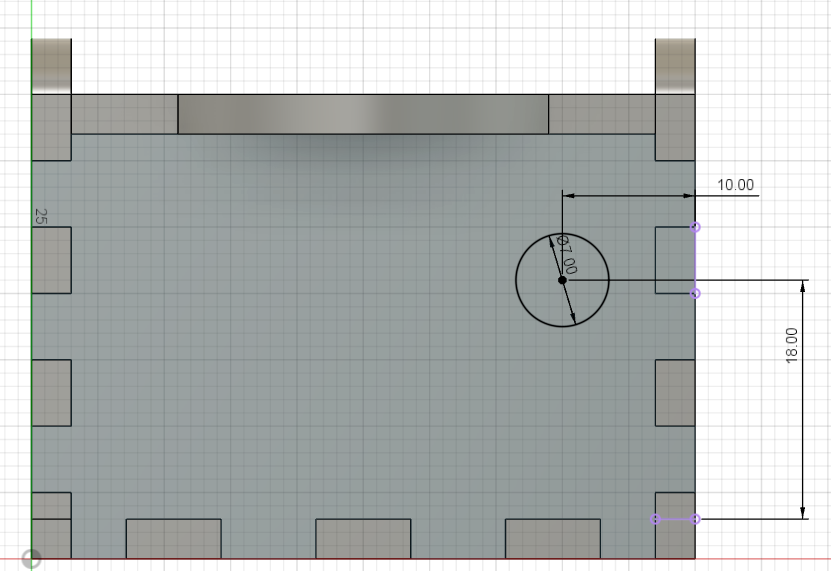{: width="40%"}
* Lastly, lets make the hole to house the winding handle so we can play the music box.
* Follow the measurements I used for my music box. Your's may vary so measure and dimension accordingly.

## Lasercut MusixBox
