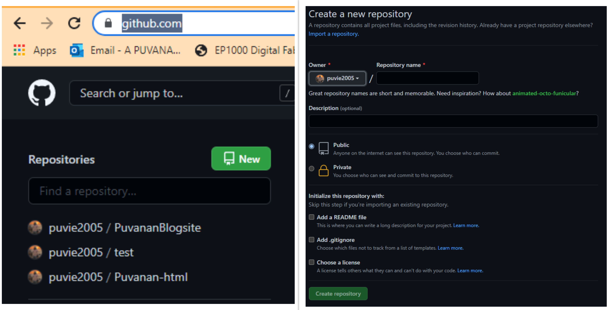
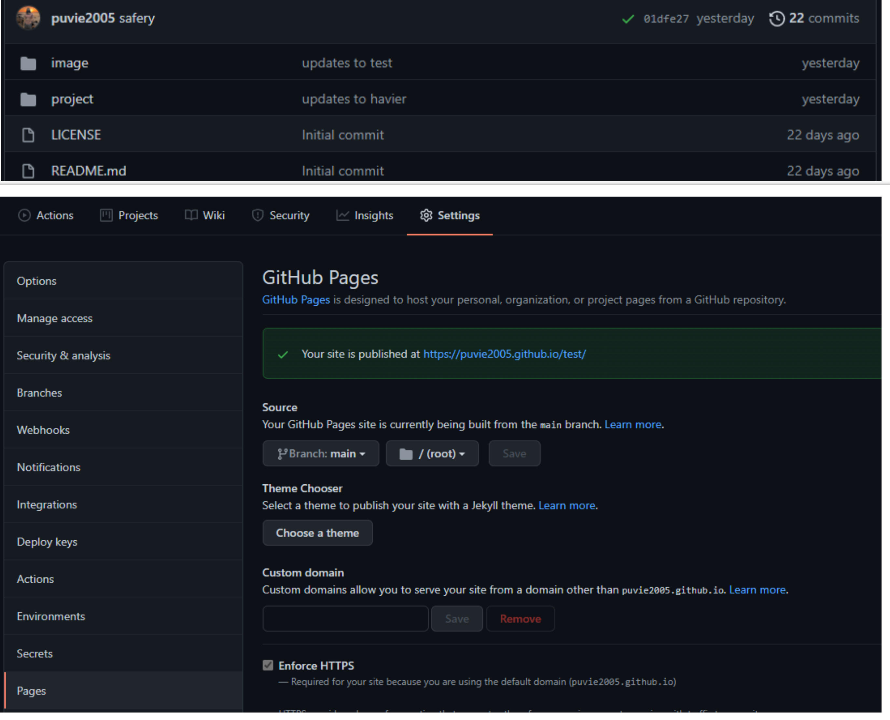
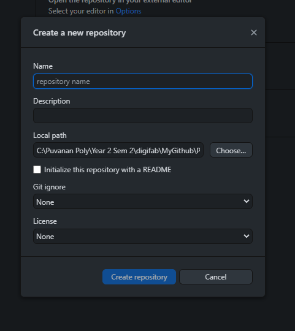
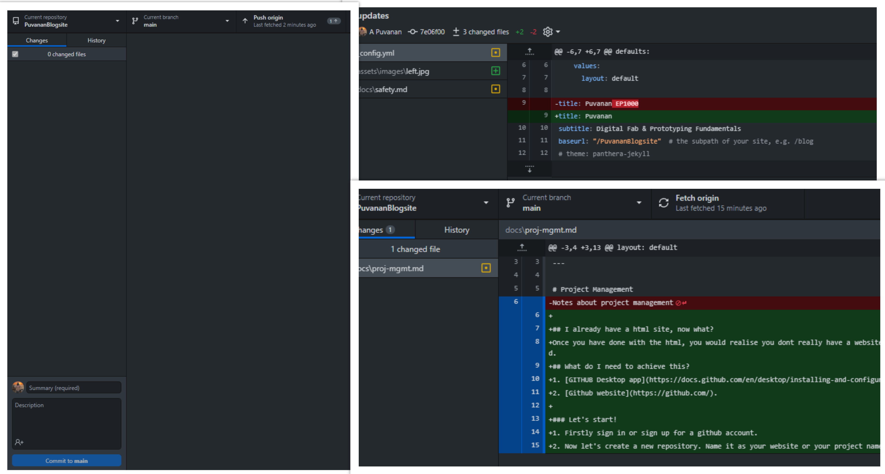

# Project Management

## I already have a html site, now what?
Once you have done with the html, you would realise you dont really have a website link and its harder to manage and keep track of your site. So, in this page we will learn how to publish our site, update it, keep track of the site and also backtrack when needed. We will be using Github to publish and maintain our site.
## What do I need to achieve this?
1. [GITHUB Desktop app](https://docs.github.com/en/desktop/installing-and-configuring-github-desktop/installing-and-authenticating-to-github-desktop/installing-github-desktop).
2. [Github website](https://github.com/).

### Sign up and repository
{: width="60%"}
* Firstly sign in or sign up for a github account.
* Now let's create a new repository. Name it as your website or your project name!
* Make sure it is set as public > Check Add Readme file
* Check license and choose MIT.

### Generate link for your github pages
{: width="60%"}
* You would have noticed the README and LICENSE files. These are your contents in your current repository.
* Go to settings > pages > select branch as main.
* Now you can see the link to your repository site!

### GITHUB Desktop app
{: width="60%"}
* Install github desktop app and sign in.
* Go to files > add new repository.
* Give a name and description of your site/ repository.
* Check initialise with README file
* Don't forget to turn on license and use the MIT license type.

### Things to do now!
{: width="60%"}
* You now have a file that can host your site with a link.
* Move your files that you have done so far to the repository filepath on your computer.
* Don't forget to change your links in the navigation lists since you have a new link.

## Maintaining your site

### Editing files
{: width="60%"}
* Once you start using the github link to test and tweak your site, you can easily track these records.
* Every time you have done a edit and want to see on you site, click save or control+s.
* Go to your GITHUB desktop app and you should see these changes under Changes tab.
* The colour in red shows what the file looked like before and the part in green is the updated part.
* Give a reason for each edit and click the "Commit to main" button.
* In order to see this edit on your site, click push to origin or control+p.

### Reverting changes & edits
{: width="60%"}
* Go to history tab and you can see all the past edits with all the reasons for each edit you have done.
* If you want to get back the original or part of the previous edit, right click on the file
* Right click and you should see the revert button.

## You now should know the basics of uploading your site onto github and maintaining it!!
