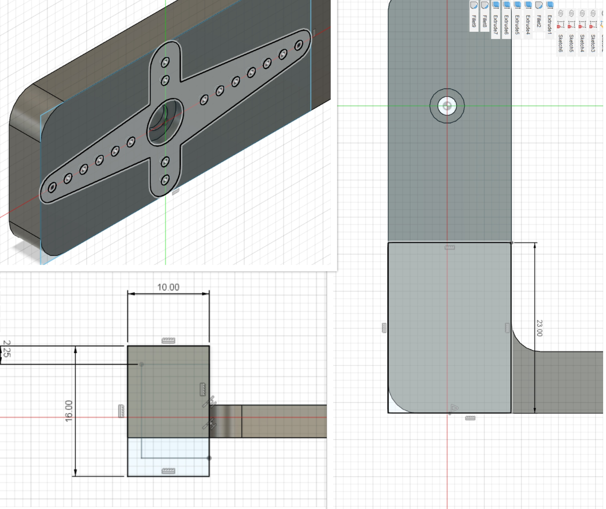

# Final Project

After almost 2 terms of learning various skills ranging from lasercutting to embedded programming, we were tasked to take on a final project. In this final project, we are to integrate 3D printing, CAD software skills and lasercutting with electronics to create a simple project. This project requires a certain level of planning and fabrication too. We are only given 3 weeks thus I went on for a simple idea. Read to find out more about my final project!

## My Sisyphean Machine
{: width="60%"}

### What does it mean?
Well the word Sysiphean is just a synonym for the word useless.I chose this because I'm going to be making a useless machine! More importantly, it relates to a task not being completed.

### What does it do?
As mentioned earlier on, I will be making a useless machine. The machine comes with a switch for the user to toggle with. However, when the user turns on/ flicks the switch, an arm within the box will pop up and will flick the switch to its original position. The machines’ main purpose is to make the user’s input futile.

### What are it's features?
The Sisyphean machine uses a servo to open the lid and turn off the switch using an arm. The machine also has certain randomized behaviors to make it interesting. It behaves by turning off the switch with emotions like anger and curiosity. This is enabled by programming a randomized movement on Arduino.

### What will I make?
<!-- CSS Code: Place this code in the document's head (between the 'head' tags) -->

<!-- HTML Code: Place this code in the document's body (between the 'body' tags) where the table should appear -->
<table class="GeneratedTable">
  <thead>
    <tr>
      <th>Process</th>
      <th>Features</th>
    </tr>
  </thead>
  <tbody>
    <tr>
      <td>CAD Design, Graphics</td>
      <td>I will be designing the housing to hold the components and the arm. I will also design the lid and arm to flick the switch.</td>
    </tr>
    <tr>
      <td>Laser cutting</td>
      <td>I will be laser cutting the walls, lid and base of the machine.</td>
    </tr>
    <tr>
      <td>3D Printing</td>
      <td>I will be 3D printing the arm to flick the switch. ( I might 3D print the case/housing for the battery and servos)</td>
    </tr>
    <tr>
      <td>Micro-controller</td>
      <td>Arduino Nano</td>
    </tr>
    <tr>
      <td>Input devices</td>
      <td>Switch and USB port</td>
    </tr>
    <tr>
      <td>Output devices</td>
      <td>Servos</td>
    </tr>
  </tbody>
</table>
<!-- Codes by Quackit.com -->

### Bill of materials
<!-- CSS Code: Place this code in the document's head (between the 'head' tags) -->

<!-- HTML Code: Place this code in the document's body (between the 'body' tags) where the table should appear -->
<table class="GeneratedTable">
  <thead>
    <tr>
      <th>Sn.</th>
      <th>Qty</th>
      <th>Item Description</th>
      <th>Approx Cost</th>
    </tr>
  </thead>
  <tbody>
    <tr>
      <td>1</td>
      <td>2</td>
      <td>Micro-Servo( 180 degrees)</td>
      <td>$5.92/pc</td>
    </tr>
    <tr>
      <td>2</td>
      <td>1</td>
      <td>Arduino Nano</td>
      <td>Fablab</td>
    </tr>
    <tr>
      <td>3</td>
      <td>1</td>
      <td>SPDT Switch</td>
      <td>$0.90/pc</td>
    </tr>
    <tr>
      <td>4</td>
      <td>1</td>
      <td>On/Off( SPST ) Rocker switch</td>
      <td>$2.06</td>
    </tr>
  </tbody>
</table>
<!-- Codes by Quackit.com -->
#### Links to Parts
* [Micro-Servo( 180 degrees)](https://sg.element14.com/mcm/83-17987/micro-servo-180-degree-for-arduinoraspberry/dp/2801406?st=micro%20servo)
* [SPDT Switch](https://robot-r-us.com.sg/p/toggle-switch-3-pin-spdt-2a-250vac)
* [On/Off( SPST ) Rocker switch](https://sg.element14.com/alcoswitch-te-connectivity/prasa1-16f-bb0bw/switch-spst-16a-125vac-black/dp/4710368?st=spst%20switch)

#### References
* [Useless Machine](https://www.instructables.com/Arduino-Most-Useless-Machine-Ever-project/)

## Design sketches
* I made a rough design of how the machine will work.
* Below are the isometric and sectional views of the sketches.

### Isometric views
{: width="30%"}
* The isometric view shows how the box looks like in 3D view.
* You can see the appendix on the image provided to see the relevant parts associated.
* I want the box to be about 25 * 15 * 10 (in cm)
### Sectional view
{: width="30%"}
* In this sectional view, you can notice how the parts are aligned
* Do note that the second servo will be place horizontally using a mount on the vertical edge of the wall.
* Arduino Uno along with its mini breadboard will be placed on the base of the box and requires no mounts as it lays down flat.

## 3D CAD. How to do?

### Full sized model
{: width="50%"}
* This is how the 3D model looks like. I have made some changes from my sketch after some research and consideration
* The dimensions have been altered to 200 * 120 * 80 ( in mm )

### Parameters
{: width="50%"}
* We will be using parametric modelling which is what we learned in our lasercutting section.
* Just a recap- parametric modelling refers to making a model on existing parameters that makes changes easier in the future( my simple explanantion).
* I have changed parameters to the above mentioned dimensions.
* We have length, width, thickness and height. Somethign new is the nseg. It refers to the number of teeth wer prefer to have on all sides of the box. ( remember it has to be a odd number )

### Designing the body
{: width="45%"}
* We start off by creating the base. Use fixed parameters by clicking tab and instead of 200mm just type length. This is how parametric modelling is done.
* Once you are done with the sketch, exit and extrude to 3mm as the wood we are lasercutting with is 3mm.

{: width="45%"}
* Next up we can go on to the walls. Create a wall with fixed paramaters according to the length and height mentioned in parameters.
* Remember to design your teeth on the bottom end of the 3mm of the lenght base.
* Create it using the nseg by creating 11 equidistant rectangles in the length. Used nseg for this ( nseg/length)- hint ( for distance )
* Extrude the wall and do not forget to extrude the teeth.

{: width="55%"}
* You can now use the combine function using tool and object settings to attach the wall with teeth onto the base
* We have learnt this before, you can head onto the lasercutting site to get a recap.
* Use the copy function to copy the wall from one point to another.
* Remember to combine the wall to the base again.

{: width="55%"}
* Now we can sketch the side wall along the width of the box
* Design the teeth on the box using nseg
* Extrude the box with the 11 teeth you have made to distance of 3mm or thk for parametric modelling purposes.
* Use combine function to combine it to the 2 wall as the tool and combine it to the base.
* Use the copy function to make a copy of it to the other side of the box and repeat the combine function again!

{: width="55%"}
* Now we can design the lid. I have design the lid in such a way that its only 1/3 of the lenght
* You can use parametric modelling at adjust the length of the lid to third of the length
* Make the teeth now all on 3 sides of the 1st lid so that it can fit Well
* Extrude the lid with its teeth and combine it to the 3 walls.

{: width="55%"}
* Now make the movable part of the lid, the door.
* As we have mentioned earlier on , the first part is 1/3 so this will be 2/3 of 200mm. Dimension it using parametric modelling
* This doesnt require any teeth as it will be a moving part
* You have to make 2 pivots on the ends of the lid so that it can pivot on it without falling!
* Extrude it 3mm down depending on the plane you have chosen to start your sketch.

{: width="55%"}
* We have created 2 pivots earlier on but there is no mount/ something to house the pivots
* We shall make a slightly larger hole so that the square pivot can move about freely
* Extrude the mount and make a hole to house the pivots
* Copy the design over to the other side and join it or repeat the same sketch.

{: width="55%"}
* We have to mount the toggle switch so lets a make a hole for it
* I found some dimeensions from the datasheet provided for the toggle switch i am using.
* I made a point in the centre of the box about more tha halfway from the length of the lid.
* Use the hole function to make a 7mm hole that is 3mm deep to make it a through hole

{: width="55%"}
* Now we make 2 holes. They are both identical
* We need 2 holes for the rocker switch to turn off and on the power supply. Another hole for power supply by the barrel jack to arduino uno.
* From my measurements both the hole for the rocker switch and the hole for the arduino uno dc power supply is the same
* I initially designed a rectangle for the rocker switch but decided to use a circular rocker switch because that it what Mr Rodney provided me with.
* Thus the hole of same diameter is made in the centre of the rectangle and another point is made beneath it.
* Extrude the first hole using cut function and use the hole function to make a flat hole through the 3mm for the second point.

### Final 3D model
{: width="50%"}
* You should have this by the end of the 3d modelling. You cant tweak it to whatever shape or size you want as we have now used Parametric modelling.
* You can download the fusion360 file of this CAD model through this [link](https://a360.co/3uTnZHk). Dont forget to enter the password "Sysiphean".
* We now head onto the 3d printed parts

## 3D Printed Parts
* I had to design the servo arm, servo arm for door and 2 servo mounts.
* Below i will show you how it was done!

### Servo arm lid
{: width="40%"}
* I used a online CAD model for the servo horn so i can directly attach it to the servo motor.
* I created a rectangular feature aroudn it extrude it.
* Later on i extended it by another 20mm to fit according to my box.
* Lastly, I made a L shaped extrusion up the arm and made a rectangular feature to push the button on toggle switch.

{: width="25%"}
* You should have this servo arm if you followed the steps above :)
* We will slice it for 3d printing later :)
* You can download the 3D model from [here](https://a360.co/3gTjAvB)

### Servo arm
{: width="25%"}
* This servo arm is similiar to the servo arm lid.
* I referenced it from a cad model of the servo horn
* I adjusted the height to 12mm instead and the length to 85mm.
* Last adjustment was the height of the arm to push button- 45mm from origin( from 0 point base )
* You can download the 3D model from [here](https://a360.co/3gYDTbf).

### Servo mount 1
{: width="50%"}
* I have dimensioned the mount according to the SG90 9g servo.
* Dimensions can be found online on google images.
* We first make a rectangle with a rectangular hole to mount the servo.
* Extrude it by 3mm and make another rectangle to extrude so that we can make it longer than the servo to let it lay flat.
* We make another rectangle on the end of the length and extrude it up to form a L bracket.
* Include holes of 2mm on the rectangular hole to mount the servos
* Iclude 3.2mm hole to screw in the mount to the wood of 3mm.

{: width="30%"}
* You should have this servo mount for 1 servo, servo door.
* We can slice it later on to print it.
* You can download the 3D model from [here](https://a360.co/3LIpb6k).

### Servo mount 2
{: width="30%"}
* This is the .stl file view of the mount in fusion.
* This servo mount is similiar to the first. It just doesnt have a L bracket to mount on walls
* We will instead put 2 3.2mm holes on the base so that we can screw it flat onto the base of the box.
* Follow the steps in servo mount 1 and design in a way that suits your design the best.

### Slicing the Parts
{: width="50%"}
* The parts have been sliced and I have used similar settings as the one I used in the Knight Chess piece.
* It took about almost 3 hours as I printed this on 2 separate occasions.

### Settings
{: width="45%"}
* These are the settings used for printing the mounts and the arm.
* I used a print speed of 60 with 60% infill density.
* Support was required for the mount but the rest did not require and thus I used skirt instead.
* Other values were set to default.

### Booking 3D printer
{: width="40%"}
* I then booked a 3D printer on T14 and printed it given in the stipulated time.
* Print quality was good and parts came out well after waiting for the heating bed to cool down.

### Final outcome
{: width="60%"}
* These are the parts that I have had to 3d print.
* The arms have been 3d printed with a thickness of 4mm
* The servos fit well and tight into place in the mounts:)

## Lasercutting

## Export your sketches
{: width="40%"}
* First create a sketch on each of the side by clicking on it and create sketch in fusion.
* Right click on the empty sketch you have just created and export to dxf.
* It should take a while but now its done and you can import in your CorelDraw and start cutting.

### Booking lasercutter
{: width="40%"}
* I booked a lasercutter to cut out all the dxf files I have exported from fusion.
* All the parts were cut in T1442 lasercutter on a 3mm wood.
* Time took about 30min from setting up to inmporting files and cutting it.
* I missed out 1 piece which was the lid and thus took an extra 5min to cut.

### Settings
{: width="50%"}
* The above settings are callibrated for the Lasercutter used in T1442
* After importing your file, we have to change the outlines to red hairline as this is recognised in the printer settings for cut.
* Choose the 3mm plywood board ( for my box anyways )
* Place your part and adjust the pointer to a free space on the wooden board.
* You can then move your parts on the software to the pointer using " move to pointer".
* Make sure the board isnt wobbly. If all is set, you are ready to cut. Just click the start button!

### Parts
{: width="40%"}
* The parts were cut and I decided to superglue the sides as a short term solutions.
* I decided to use woodglue once I headed home to join the parts with a stronger bonding agent. You can use any of the 2, they both work fine.
* You can also download the .dxf files from the following link. Its a zip file so unzip it !

{: width="40%"}
* Above are the parts I have cut.
* We Have a total of 7 pieces with 1 of it being a movable one.
* The pieces are as follows; 2 walls, 2 short walls, base, movable lid and stationery lid.

### Lasercutter in action!
{: width="40%"}

## Electronics

### Components required
{: width="40%"}
1. SG90 9G servo x2
2. 1 toggle switch ( SPDT)
3. 1 Rocker switch ( on/off)
4. Resistor
5. Jumper wires :)

### Schematic and simulation
{: width="50%"}
* On your servo, there are 3 wires. The brown wire goes to Ground and the wire next to it goes to Vcc/5v. The last wire goes to your digitalpin to recieve signals.
* I have connect 5v and Ground to the respective rails on the breadboard.
* Connect your servo that controls the door to pin 9 and the other 2 wires to 5v and Ground.
* Same goes for your servo to turn off switch. But connect the 3rd wire to pin 10.
* We only need 2 states in this SPDT switch. The middle pin goes to 5V.
* Connect a resistor across the 3rd pin of the switch. The other end of the resistor is connected to Ground.
* The resistor end that it connected to the 3rd pin must also have a connection to pin2. That should be it!

{: width="50%"}
* This is the simulation of the servos. Do note that tinkercad uses 180 degree servos instead continous rotation 360.
* The door is callibrated to move to it test position whenever the program starts.
* When the switch is pressed, it makes the servo door turn from a specified degree to another position. ( we will talk about this in the coding portion )
* AFter the door servo does its rotation, the arm servo turns to a certain degree( TWEAK according to your box, everyones positions varies ).
* There are different cases in this useless machine where it "behaves" differently.
* You can download or tinker with the tinkercad file through [here](https://www.tinkercad.com/things/h3ESu6dquIS)

### How it works in real life
{: width="50%"}
* This is how it looks like in real life.
* I decided to use a normal slide switch for testing purposes as it is small and serves the same purpose in the breadbaord.
* All the 5v and ground for servos and switch have been connected to their respective rails in the front of the breadboard.
* I used my own Arduino Uno as the given Uno is unrecognisable in the computer ports.

{: width="25%"}
* This is how it works in real life.
* You can notice the different cases it goes through.
* Whenever I slide the slide switch, the door servo is actuated then the arm servo is actuated.
* Once the switch is closed, it returns back to its original position.
* The different cases are seen where it after a certain number of times pressing the switch, it behaves fast and slow and etc.

## Coding
* There are few different cases/moves that I have tweaked to my liking.
* I used the code to figure out the exact positions of the servos when they are hiding and when they are in action.
* Please try out the code and test the exact positions to get the right ones for yourself.

### Initialisation
{: width="50%"}
* We will be using the servo.h libary for this code.
* Start off by initialising the library and the 2 different servos we are using. Give them names.
* Assign int pin to pin 2 as per our connection
* Set the int pos to 0 and selectedmove to 0 for count in if else statement.
* Lastly set testmove to 0 as this will intitialise the start of our code when it runs.

### Void setup
{: width="50%"}
* By using pinmode function, set the switch to an input to recieve inputs.
* The next following lines are fron the servo.h libary.
* Servo.attach() is used to assign the pins that the servos are connected.
* We have named at the start to intialise the servos. Use these names and servo.attach.
* Servo.write is used to assign their intitial positions. Change them according to your box avia test and trial.

### Void loop
{: width="50%"}
* The loop uses if else statements to toggle between different states.
* By using a count system, whenever switch is pressed, different moves are toggled between
* The total moves have been capped at 10 but you can alter it to whatever you want.
* I have 4 different moves that i tweaked to my preferences. Each has its own void.
* Assign each void move to a count for if else statement.

### Move 1 Logic
{: width="50%"}
* I found out that the hiding position for the door is at 10 and I want to move it up to 60 degrees.
* We use a for loop to increase the degrees in increments of 3.
* In the loop, the first part is start position; second is final position; lastly the increment count.
* You can use the Servo.write function to simplify your code and make the servo turn according to the pos you have set in the for loop.
* Do the same for the arm servo.
* You can use the for loop again to make it go back to its original position as you can see above. Remember to change the increment to a negative instead of positive or it wont work.
* Lastly, do not forget delay in between each rotation of servo.

### Example of move 2
{: width="50%"}
* The previous move was just a normal move where it turns on and off
* I want to give it a little bit of a "behavior". Lets make things slow!
* You can employ the same logic from the previous example.
* However, remember to decrease the increment. This makes thing move slow ( degrees increase slowly =  servo rotate slowly )
* Tweak and test out and see what you like. Make sure the useless machine works the way you like it to

### Working Code test
{: width="30%"}
* This is the code test in real life without the switch.
* We observe how the arm interacts with the box.
* Use this as an opportunity to tweak the code to position you servo and make it good!

### My code
* Below is my code that I have used for My Sysiphean Machine.
* I have explained the code above and refer to that if you have any problems!
* Remember to tweak the servo positions to however you like.

<pre>
  <code>
  #include <Servo.h>
  Servo doorServo;
  Servo handServo;

  int switch_pin = 2;               //set switch on pin 2
  int pos = 0;
  int selectedMove = 0;             //move selector
  int Testmove = 0;                 //test mode: set to move number to test only one selected move
                                    //(set to Zero to run normally i.e: roundrobbin on amm moves)
  void setup()
  {
    Serial.begin(9600);
    pinMode(switch_pin, INPUT);
    doorServo.attach(9);           //set door servo on Pin 9 pwm
    handServo.attach(10);          //set hand servo on Pin 10 pwm
    doorServo.write(0);           //set door to hiding position
    handServo.write(0);            //set hand to hiding position  
  }

  void loop()
  {
  if (Testmove != 0) {
  selectedMove = Testmove;
  }

    //if the switch is on, then move door and hand to switch it off...
    if(digitalRead(switch_pin) == HIGH)
    {

    if (selectedMove > 10) { selectedMove = 0; } //when all moves are played, repeat the moves from beginning

    if (selectedMove == 0) { switchoff(); }
    else if (selectedMove == 1) { switchoff(); }   
    else if (selectedMove == 2) { crazydoor(); }
    else if (selectedMove == 3) { switchoff(); }
    else if (selectedMove == 4) { crazyslow(); }
    else if (selectedMove == 5) { matrix(); }

    if (Testmove == 0) {
    selectedMove++;         //swith to next move if not in test mode
    }

  }
  }

  // Library of moves

      // basic move 1
     void switchoff()
     {    
  //Moving door
      for(pos = 0; pos < 60; pos += 3)   
      {                                   
      doorServo.write(pos);              
      delay(15);                       
      }

      //Moving hand
      for(pos = 130; pos >= 10; pos -= 4)  
      {                                   
      handServo.write(pos);               
      delay(15);                       
      }  

      //hiding hand
      for(pos = 10; pos<130; pos+=4)      
      {                                
      handServo.write(pos);               
      delay(15);                        
      }

      //hiding door
      for(pos = 60; pos>=0; pos-=3)     
      {                                
      doorServo.write(pos);              
      delay(25);                      
      }
     }    

    //move 3: open door then close it many times, wait, then quickly reoprn a nd switch off and hide.

     void crazydoor()
    {
       //Moving door
      for(pos = 0; pos < 60; pos += 3)   
      {                                   
      doorServo.write(pos);              
      delay(15);                       
      }
      delay(800);
      //Moving hand
      for(pos = 130; pos >= 80; pos -= 4)
      {                                   
      handServo.write(pos);               
      delay(15);                       
      }
      delay(1000);
      for(pos = 80; pos >= 50; pos -= 4)  
      {                                   
      handServo.write(pos);               
      delay(15);                       
      }    

      //hiding hand
      for(pos = 50; pos<130; pos+=4)      
      {                                
      handServo.write(pos);               
      delay(15);                        
      }

      //hiding door
      for(pos = 60; pos>=0; pos-=3)     
      {                                
      doorServo.write(pos);              
      delay(25);                 
      }
     }    

    // move 4: open door, then move hand very slowly forward and back to hiding very slowly, then quickly close door
   void crazyslow()
   {
   //Moving door
      for(pos = 0; pos < 60; pos += 1)   
      {                                   
      doorServo.write(pos);              
      delay(30);                       
      }

      //Moving hand
      for(pos = 130; pos >= 10; pos -=1)  
      {                                   
      handServo.write(pos);               
      delay(30);                       
      }  

      //hiding hand
      for(pos = 10; pos<130; pos+=1)      
      {                                
      handServo.write(pos);               
      delay(30);                        
      }

      //hiding door
      for(pos = 60; pos>=30; pos-=0.5)     
      {                                
      doorServo.write(pos);              
      delay(30);                      
      }
      delay(500);
      for(pos = 20; pos>=0; pos-=4)     
      {                                
      doorServo.write(pos);              
      delay(15);                      
      }    
   }
   void matrix()
   {
     //Moving door
       for(pos = 0; pos < 60; pos += 3)   
      {                                   
      doorServo.write(pos);              
      delay(15);                       
      }

      //Moving hand
      for(pos = 130; pos >= 90; pos -= 4)  
      {                                   
      handServo.write(pos);               
      delay(15);                       
      }

      for(pos = 90; pos >= 50; pos -= 1)  
      {                                   
      handServo.write(pos);               
      delay(30);                       
      }  
      delay(300);

      for(pos = 55; pos<130; pos+=4)      
      {                                
      handServo.write(pos);               
      delay(10);                        
      }

      //hiding door
      for(pos = 60; pos>=0; pos-=3)     
      {                                
      doorServo.write(pos);              
      delay(25);                                      
      }
   }
  </code>
</pre>

## Assembly
{: width="30%"}
* This is the assembly video of all the lasercut components.
* It is sped up so you wont be wasting your time!

## Problems faced

### 1.Insufficient torque
{: width="30%"}
* Not enough torque was produced by the micro servo.
* The arm length was abit too long to produce enough moment and torque to turn off the switch.
* Even with increased speed or change in microservo, there was no difference.
* Furthermore, because of this stoppage, it caused the servo to heat up as it coudlnt handle it.

### 2.Weak mount
{: width="20%"}
* The mount for the door servo was wobbly.
* It didnt have enough support and it gave away at times.
* Since it was weak, the servo tend to droop down affecting the position of the arm and the degree it turns. Which has to be changed via code.
* A better way to design this would be to use 90 degrees down extrude or a Rib/web.

### 3.Not enough surface area
* The servo arm was long enough but the feature that helps push the switch was extruded up.
* Since it extruded up, it couldnt cover any area below which might also be a reason for not turning off the switch.
* Even after changing to a slide switch from a toggle switch, the torque was sufficient but surface area covered wasn't enough.

## Troubleshooting

### 1. Torque fixed
{: width="20%"}
* The toggle switch was tight.
* Even after oiling it, it wasnt smooth.
* I switched to a slide switch. It is much smoother and easier to push.
* Did not have to make much changes. I only had design 1 part and lasercut it. Instead of a hole, i changed it to a 11mm by 6mm rectangle to screw the switch.

### 2. Stronger mount
{: width="25%"}
* I extruded the L bracket down to create even more support.
* Only issue that I faced was requiring more support than the previous mount.
* Luckily, support came off easily and the mount is much stronger and can support high torque and force from servo to door.

### 3. Arm Feature
{: width="25%"}
* I had a rectangular extrude 3D printed to add onto the existing arm.
* Instead of wasting filament, I used an attachment which helped to push the switch further.
* Did not waste parts and time :)

## Working model
{: width="25%"}

## Modes

### Switch_off
{: width="25%"}
* Simple push and hide mode
* Door moves from position 0 to 60 and back again
* Arm moves from 130 to 0 and back again
* This is the start mode when switch is pressed.\

### Crazyslow
{: width="25%"}
* Code is similar to Switch_off
* Instead of going normal speed, it irritates the user by going very very very very slow.
* when it returns it goes slow, but on th return, the door shuts you off fast.

### Crazydoor
{: width="25%"}
* Crazy door employs similar code to the Switch_off too.
* However, it fakes the user by turning off, but it hides back in.
* As the user thinks that their input is successful, the machine renders it futile!

### Matrix
{: width="25%"}
* Matrix is basically similar to crazydoor but employs the function differently.

## Video Submission
