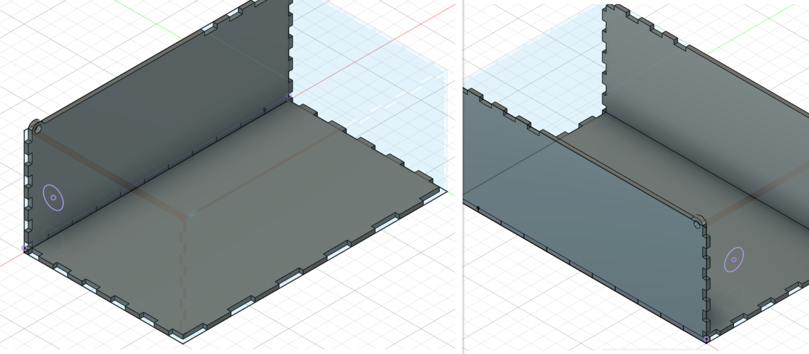

# Final Project

After almost 2 terms of learning various skills ranginf from lasercutting to embedded programming, we were tasked to take on a final project. In this final project, we are to integrate 3D printing, CAD software skills and lasercutting with electronics to create a simple project. This project requires a certain level of planning and fabrication too. We are only given 3 weeks thus I went on for a simple idea. Read to find out more about my final project!

## My Sisyphean Machine

### What does it mean?
Well the word Sysiphean is just a synonym for the word useless.I chose this because I'm going to be making a useless machine! More importantly, it relates to a task not being completed.

### What does it do?
As mentioned earlier on, I will be making a useless machine. The machine comes with a switch for the user to toggle with. However, when the user turns on/ flicks the switch, an arm within the box will pop up and will flick the switch to its original position. The machines’ main purpose is to make the user’s input futile.

### What are it's features?
The Sisyphean machine uses a servo to open the lid and turn off the switch using an arm. The machine also has certain randomized behaviors to make it interesting. It behaves by turning off the switch with emotions like anger and curiosity. This is enabled by programming a randomized movement on Arduino.

### What will I make?
<!-- CSS Code: Place this code in the document's head (between the 'head' tags) -->

<!-- HTML Code: Place this code in the document's body (between the 'body' tags) where the table should appear -->
<table class="GeneratedTable">
  <thead>
    <tr>
      <th>Process</th>
      <th>Features</th>
    </tr>
  </thead>
  <tbody>
    <tr>
      <td>CAD Design, Graphics</td>
      <td>I will be designing the housing to hold the components and the arm. I will also design the lid and arm to flick the switch.</td>
    </tr>
    <tr>
      <td>Laser cutting</td>
      <td>I will be laser cutting the walls, lid and base of the machine.</td>
    </tr>
    <tr>
      <td>3D Printing</td>
      <td>I will be 3D printing the arm to flick the switch. ( I might 3D print the case/housing for the battery and servos)</td>
    </tr>
    <tr>
      <td>Micro-controller</td>
      <td>Arduino Nano</td>
    </tr>
    <tr>
      <td>Input devices</td>
      <td>Switch and USB port</td>
    </tr>
    <tr>
      <td>Output devices</td>
      <td>Servos</td>
    </tr>
  </tbody>
</table>
<!-- Codes by Quackit.com -->

### Bill of materials
<!-- CSS Code: Place this code in the document's head (between the 'head' tags) -->

<!-- HTML Code: Place this code in the document's body (between the 'body' tags) where the table should appear -->
<table class="GeneratedTable">
  <thead>
    <tr>
      <th>Sn.</th>
      <th>Qty</th>
      <th>Item Description</th>
      <th>Approx Cost</th>
    </tr>
  </thead>
  <tbody>
    <tr>
      <td>1</td>
      <td>2</td>
      <td>Micro-Servo( 180 degrees)</td>
      <td>$5.92/pc</td>
    </tr>
    <tr>
      <td>2</td>
      <td>1</td>
      <td>Arduino Nano</td>
      <td>Fablab</td>
    </tr>
    <tr>
      <td>3</td>
      <td>1</td>
      <td>SPDT Switch</td>
      <td>$0.90/pc</td>
    </tr>
    <tr>
      <td>4</td>
      <td>1</td>
      <td>On/Off( SPST ) Rocker switch</td>
      <td>$2.06</td>
    </tr>
  </tbody>
</table>
<!-- Codes by Quackit.com -->
#### Links to Parts
* [Micro-Servo( 180 degrees)](https://sg.element14.com/mcm/83-17987/micro-servo-180-degree-for-arduinoraspberry/dp/2801406?st=micro%20servo)
* [SPDT Switch](https://robot-r-us.com.sg/p/toggle-switch-3-pin-spdt-2a-250vac)
* [On/Off( SPST ) Rocker switch](https://sg.element14.com/alcoswitch-te-connectivity/prasa1-16f-bb0bw/switch-spst-16a-125vac-black/dp/4710368?st=spst%20switch)

#### References
* [Useless Machine](https://www.instructables.com/Arduino-Most-Useless-Machine-Ever-project/)

## Design sketches
* I made a rough design of how the machine will work.
* Below are the isometric and sectional views of the sketches.

### Isometric views
{: width="60%"}
* The isometric view shows how the box looks like in 3D view.
* You can see the appendix on the image provided to see the relevant parts associated.
* I want the box to be about 25 * 15 * 10 (in cm)
### Sectional view
{: width="60%"}
* In this sectional view, you can notice how the parts are aligned
* Do note that the second servo will be place horizontally using a mount on the vertical edge of the wall.
* Arduino Uno along with its mini breadboard will be placed on the base of the box and requires no mounts as it lays down flat.

## 3D CAD. How to do?

### Full sized model
{: width="40%"}
* This is how the 3D model looks like. I have made some changes from my sketch after some research and consideration
* The dimensions have been altered to 200 * 120 * 80 ( in mm )

### Parameters
{: width="40%"}
* We will be using parametric modelling which is what we learned in our lasercutting section.
* Just a recap- parametric modelling refers to making a model on existing parameters that makes changes easier in the future( my simple explanantion).
* I have changed parameters to the above mentioned dimensions.
* We have length, width, thickness and height. Somethign new is the nseg. It refers to the number of teeth wer prefer to have on all sides of the box. ( remember it has to be a odd number )

### Designing the body
{: width="40%"}
* We start off by creating the base. Use fixed parameters by clicking tab and instead of 200mm just type length. This is how parametric modelling is done.
* Once you are done with the sketch, exit and extrude to 3mm as the wood we are lasercutting with is 3mm.

{: width="40%"}
* Next up we can go on to the walls. Create a wall with fixed paramaters according to the length and height mentioned in parameters.
* Remember to design your teeth on the bottom end of the 3mm of the lenght base.
* Create it using the nseg by creating 11 equidistant rectangles in the length. Used nseg for this ( nseg/length)- hint ( for distance )
* Extrude the wall and do not forget to extrude the teeth.

{: width="40%"}
* You can now use the combine function using tool and object settings to attach the wall with teeth onto the base
* We have learnt this before, you can head onto the lasercutting site to get a recap.
* Use the copy function to copy the wall from one point to another.
* Remember to combine the wall to the base again.

## 3D Printed Parts

## Lasercut Parts

## Electronics

## Coding

## Assembly

## Troubleshooting

## Problems faced

## Final build. Working model
