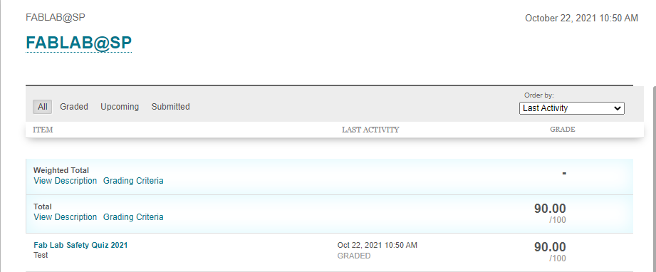
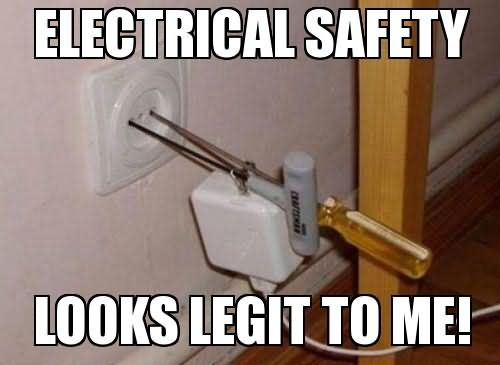
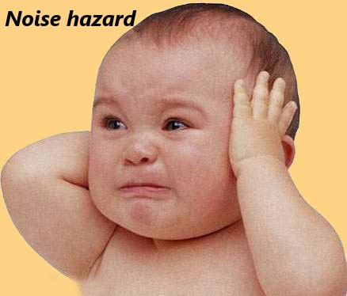

# FabLab Safety

## Introduction to safety

## Relevant information
In case of any emergency, please seek help via the following numbers
* For Ambulance call 995
* For SCDF call 995
* For Police call 999
* SP Emergency hotline 6772-1234

## Safety Quiz
**A compulsory safety quiz had to be passed prior to our EP1000 lessons and Fablab sessions. It can be accessed via Blackboard. My Community> Fablab> Fablab quiz**

{: width="40%"}

### Passing requirements
-  Minimum of 90/100 had to be scored within 5 tries to pass the quiz.
-  However, some troubles were faced whereby the quiz glitched and maxed out the 5 tries. It was resolved by Mr Rodney who reset the 5 tries.

## Important things to take note of..

* **General guidelines for attire. These guidelines are important as they ensure the safety and well being of the students around machinery.**

{: width="30%"}

* **Various safety warnings and hazards we should know and adhere to in the FabLab.**

{: width="40%"}

* **Lastly, this is the placard showing warning risks on the machinery. Please take note of it prior to using the machine. After using the machine, please place the placard back on the machine**.

{: width="40%"}

## Basic Safety Rules
1. Report all injuries no matter how minor to the staff in charge.
2. Do not operate any machinery unless trained in its safe usage and given permission to do so.

### Keep the workplace neat and orderly after use by..
1. Returning tools to their designated storage areas.
2. Cleaning up debris and chips.
3. Recycling leftover materials.
4. Report all unsafe conditions or acts to your staff in charge.
5. Wear Personal Proctective Equipment (PPE) when appropriate.

### Emergency Procedures
* If the alarm sounds, stop work immediatly and wait for staff in charge.
* If a fire starts in the lab inform everyone immediatly and leave the lab.
* When reporting emergencies please seek the help of the staff.

## Hazards

### Hazards associated with machinery
1. The machine's "perimeter"- Area around a machine, where falling objects, flying debris or other hazards can be encountered.
2. The "drive train"- The moving parts that run the machine.
3. "Points of operation"- Location where a machine's mechanical or electricalenergy is used to cut, bend or otherwise process materials.

### Common hazards
Some of the few mechanical and non-mechanical hazrads...

{: width="28%"}{: width="24%"}{: width="36.5%"}
