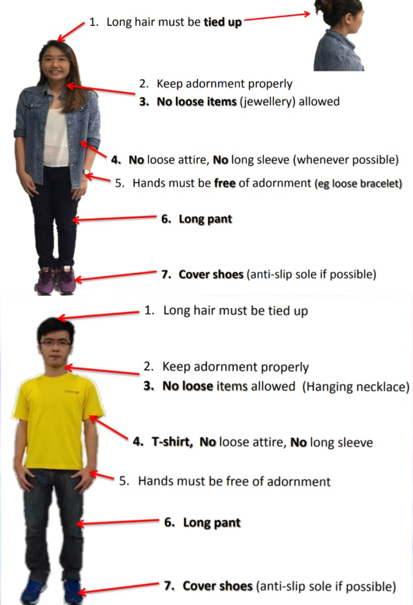
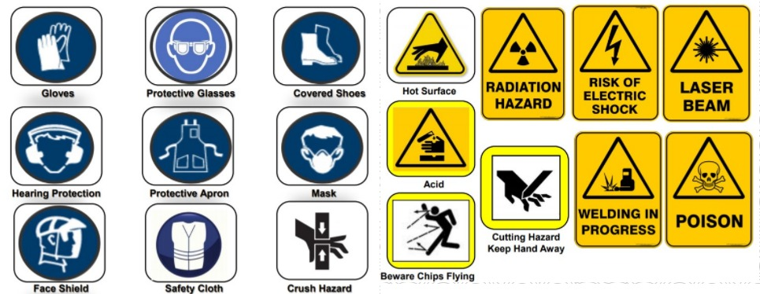
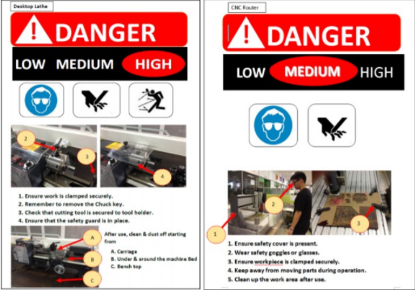

# FabLab Safety

## Introduction to safety

## Safety Quiz
A compulsory safety quiz had to be passed prior to our EP1000 lessons and Fablab sessions. It can be accessed via Blackboard. My Community> Fablab> Fablab quiz

### Passing requirements
-  Minimum of 90/100 had to be scored within 5 tries to pass the quiz.
-  However, some troubles were faced whereby the quiz glitched and maxed out the 5 tries. It was resolved by Mr Rodney who reset the 5 tries.

## Important things to take note of..

General guidelines for attire. These guidelines are important as they ensure the safety and well being of the students around machinery.
{: width="20%"}

Various safety warnings and hazards we should know and adhere to in the FabLab.
{: width="30%"}

Lastly, this is the placard showing warning risks on the machinery. Please take note of it prior to using the machine. After using the machine, please place the placard back on the machine.
{: width="40%"}

## 3D printing
-  These are the safety tips and knowledge required to use the 3D printer.

## Laser Cutting
-  These are the safety tips and knowledge required prior to laser cutting in the Fablab.
