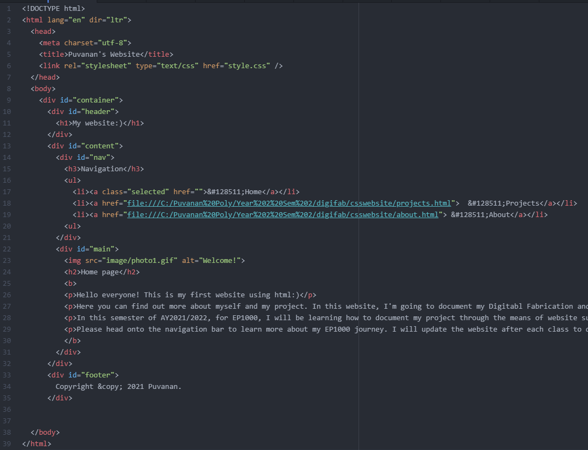
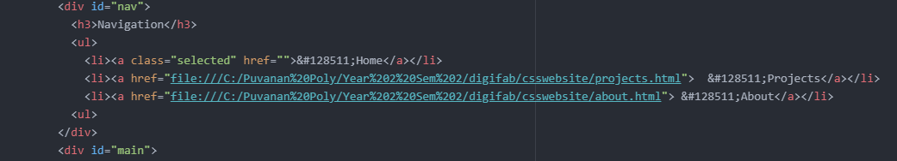
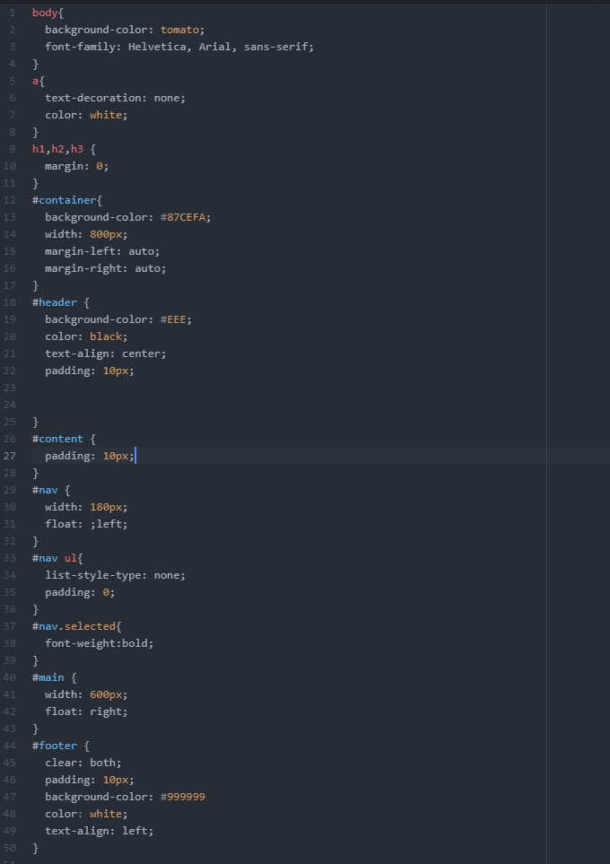
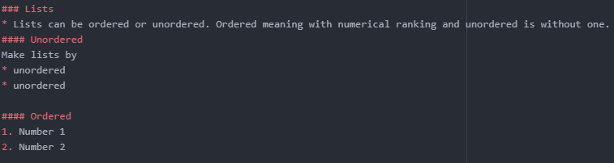
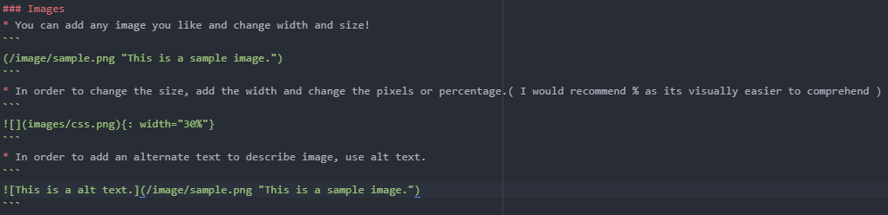
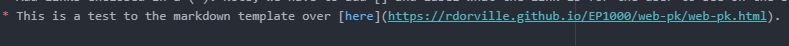

# Web Development

I was taught how to create websites using **HTML/CSS** or **Markdown**. However, I chose to use markdown using Mr Steven's template from Github.

## Why did I choose Markdown?
I used the web-pk Jekyll template( EP100 ). I will list down my reasons for choosing Markdown over HTML/CSS below.
<style>
table.GeneratedTable {
  width: 100%;
  background-color: #ffffff;
  border-collapse: collapse;
  border-width: 2px;
  border-color: #0091ff;
  border-style: solid;
  color: #000000;
}

table.GeneratedTable td, table.GeneratedTable th {
  border-width: 2px;
  border-color: #0091ff;
  border-style: solid;
  padding: 3px;
}

table.GeneratedTable thead {
  background-color: #0091ff;
}
</style>
<!-- HTML Code: Place this code in the document's body (between the 'body' tags) where the table should appear -->
<table class="GeneratedTable">
  <thead>
    <tr>
      <th>Why Markdown?</th>
      <th>Why not HTML/CS</th>
    </tr>
  </thead>
  <tbody>
    <tr>
      <td>Design and layout is very clean and simple</td>
      <td>Editing mistakes is not as easy as markdown</td>
    </tr>
    <tr>
      <td>Easy to read and type out website is simplified</td>
      <td>Markdown template looks more professional than CSS</td>
    </tr>
    <tr>
      <td>Saves alot of time as it converts to HTML quickly</td>
      <td>Prefer the flow and writing of markdown than HTML</td>
    </tr>
  </tbody>
</table>


*  However, I completed the HTML/CSS tasks and created my very own website. Do check it out at the link below!
*  Link to my [HTML/CSS Puvanan website](https://puvie2005.github.io/Puvanan-html/index.html).

## How did I create my HTML/CSS website?

### Template for pages HTML

Following picture was roughly the template used to create the [HTML layout](https://www.youtube.com/watch?v=0afZj1G0BIE/). It includes header, title, navigation and other features.
This template can be used for other pages like mine. I have used this to create my about page and projects page.

{: width="50%"}

Some things to take note are..
1. Open up a code editor like Atom or Visualstudio and type "html5". This should bring out the title>body>header layout
2. Save the file and change address to ".html". This makes the file a html and we can view it on our browser when we click.
3. Mess around and get a rough layout so you can copy paste to new files instead of creating from scratch( **Mr Rodney's tips** )

### Things to take note of

1. You should plan out your website and get your dimensions right.
2. Use either % proportions or in terms of pixels. eg; 30%, 400 px and etc.
3. Use align and margin functions to position texts and sections appropriately.
4. Padding are used to provide spacing between edges of sections. I have used 10px generally in accordance to Jake Wright template.
5. Customise the bsckground using " background-colour: " and fonts using "font-family: "
6. Using [W3Schools](https://www.w3schools.com/html/html_intro.asp) gives you a good intro to HTML/CSS. Head on over to learn more!

### Navigation bar
The sidebar was created using the lists function in HTML. The bar is sectioned using the <div> function.
The links that guide to the appropriate sites are enabled via a h-ref function.

{: width="50%"}

In order to create a the navigation bar you need to know few things!
1. Use the div function to section the area for Navigation
2. After enclosing the headers, start of by creating unordered list using <ul > designation.
3. I used the link function(<li>) along with " a href" to enclose the link. <li>
4. Include the right link from the folder its from or it wont show up.

### CSS formatting
A style.css file had to be created to provide the html site with a layout. This template is referenced from [Jake Wright](https://www.youtube.com/watch?v=0afZj1G0BIE/).
The page is broken up into different portions. Each portion has are divided and given spaces using padding and margin aligning.

{: width="30%"}

1. Imagine splitting your website into different sections. We want a navigation, content, container, main and lastly a footer.
2. Work out some dimensions in either pixels or percentage on how you want it.
3. Follow the layout to make a similiar box looking main page. **You can edit the width of page by changing container width to more than 800px.**

## How did I create my Markdown site?
I used Mr Steven's EP100 markdown template from GITHUB. You can find more about downloading it over [here](https://rdorville.github.io/EP1000/web-pk/web-pk.html).

### Introduction
* Markdown is a lightweight markup language for creating formatted text using a plain-text editor. Personally, I believe markdown is a much simpler than html and thus went on with this.
* Let's learn some basics so we can update our website as per our preference.

### Headers
## Header 2 ( H2 )
### Header 3 ( H3 )
#### Header 4 ( H4 )
- Note: Limit to 1 H1 per page as your markdown page comes with a H1 initially!
* Biggest size is 1 and to decrease header size, just increase the number. Note: Too small of a header might be hard to see, so play around with it!

### Font and sizing
* *This makes my text italic*
```
*This makes my text italic*
or
_This makes my text italic_
```
* **This makes my text bold**
```
**This makes my text bold**
or
__This makes my text bold__
```

### Lists
* Lists can be ordered or unordered. Ordered meaning with numerical ranking and unordered is without one.
#### Unordered
* Ordered
#### Ordered
1. Number 1
#### Example
{: width="50%"}
### Images
{: width="50%"}

### Links
* Adding links will be pretty important in a website to guide users to resources and other sites for references.
* Add links enclosed in a ( ). Note, we have to add [] and label what the link is for the user to see on the site.
* This is a test to the markdown template over [here](https://rdorville.github.io/EP1000/web-pk/web-pk.html).
#### Example
{: width="40%"}

###
